# Software Design and Architecture Description (SDD/SAD)
## Project: `ToKi`

## 1. Purpose

This document describes the implemented architecture of `ToKi` for engineering and maintenance work. It is grounded in the current repository state, not just the roadmap material. The focus is on clear ownership boundaries, especially the split between:

- authored project data
- shared simulation logic
- rendering infrastructure
- runtime orchestration
- editor orchestration

Primary readers:

- engine contributors extending simulation, rendering, or runtime bootstrap
- editor contributors extending project, scene, or map-authoring workflows
- maintainers reviewing whether new work respects existing layer boundaries

## 2. System Context

`ToKi` is a local-first 2D game-engine workspace for authoring and running Game Boy-style top-down games. It currently exposes two executable products:

- `toki-editor`: design-time GUI application for project, scene, map, entity, and object authoring
- `toki-runtime`: runtime application for loading a project or packed game, running the simulation, and presenting audio/video output

Supporting crates provide the shared substrate:

- `toki-schemas`: canonical JSON schema payloads
- `toki-core`: domain models, asset models, simulation, collision, scene/rule logic, serialization
- `toki-render`: reusable WGPU rendering infrastructure and text rendering

High-level context:

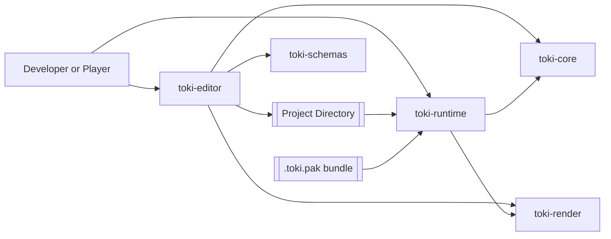

Main persisted surfaces:

- `project.toml`: project metadata, runtime settings (display, audio, splash, menu, timing mode)
- `scenes/*.json`: scene documents referencing maps and containing scene entities and rules
- `entities/*.json`: entity definitions used for placement and spawning
- `assets/tilemaps/*.json`: tilemap assets with tile grid plus map-owned object instances
- `assets/sprites/*.json`: sprite atlases and object sheets
- `assets/audio/**/*`: music and sound effects (sfx/, music/ subdirectories)
- `toki_editor_config.json`: editor-local configuration outside project scope

## 3. Architectural Overview

The codebase follows a layered architecture with an explicit design-time/runtime split. The most important rule is that authority flows downward:

- schemas define valid serialized shapes
- project files define authored content
- core defines simulation meaning
- render defines GPU execution
- runtime and editor translate external events into core/render calls

### 3.1 Layer stack

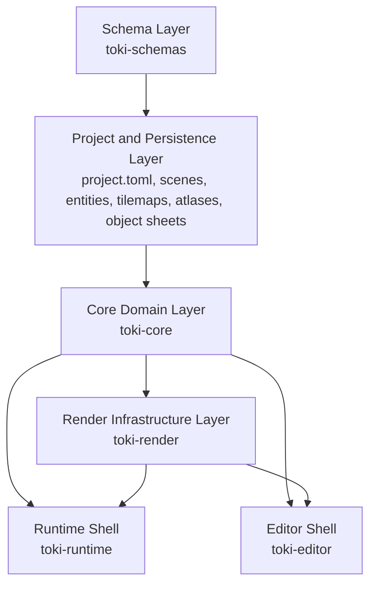

### 3.2 Layer responsibilities

| Layer | Main artifacts | Responsibility | Must not own |
|---|---|---|---|
| Schema | `crates/toki-schemas/schemas/*.json` | Canonical document shapes | editor flow, runtime simulation |
| Project and persistence | `project.toml`, scene/entity/map/atlas/object-sheet JSON | Authored game content and settings | GPU logic, platform lifecycle |
| Core domain | `toki-core` | Asset models, runtime state, rules, collision, animation, serialization | egui, winit, WGPU orchestration |
| Render infrastructure | `toki-render` | Render targets, pipelines, scene snapshots, text layout | gameplay rules, project scanning |
| Runtime shell | `toki-runtime` | startup, resource loading, pack extraction, per-frame execution, audio dispatch | authoring workflows |
| Editor shell | `toki-editor` | project IO, asset scanning, inspector, scene viewport, map editor, validation | authoritative gameplay semantics |

### 3.3 Design-time/runtime split

The key architectural distinction is between authored content and executable state.

Design-time examples:

- `ProjectMetadata`
- `Scene`
- `EntityDefinition`
- `TileMap`
- `AtlasMeta`
- `ObjectSheetMeta`

Runtime examples:

- `GameState`
- `EntityManager`
- `Entity`
- runtime audio components
- camera follow state
- render snapshots (`SceneData`, `SpriteInstance`, debug shapes)

The editor frequently converts design-time state into runtime-style state for preview and inspection, but the editor does not become the source of truth for simulation semantics. `toki-core` remains authoritative.

## 4. Static View

### 4.1 Workspace dependency view

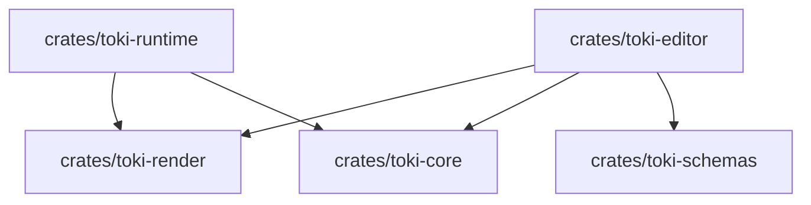

Practical note:

- the editor depends conceptually on `toki-core`, `toki-render`, and `toki-schemas`
- the runtime depends on `toki-core` and `toki-render`
- project files and schema payloads are the shared contract between both applications

### 4.2 Crate-level decomposition

#### `toki-schemas`

Responsibilities:

- embed canonical schema payloads with `include_str!`
- expose `SCHEMA_FILES` for editor validation
- define the valid serialized shapes for:
  - `scene`
  - `entity`
  - `atlas`
  - `map`
  - `object_sheet`

It intentionally does not:

- scan a project
- validate files itself
- know runtime/editor-specific workflows

#### `toki-core`

`toki-core` is the authoritative domain layer.

Key areas:

| File/module | Responsibility |
|---|---|
| `src/entity.rs` | runtime `Entity`, `EntityManager`, `EntityDefinition`, control roles, AI behavior, movement profiles, entity audio settings |
| `src/game/` | modularized `GameState` with focused submodules (see below) |
| `src/project_runtime.rs` | shared runtime/project configuration contract used by editor and runtime |
| `src/project_assets.rs` | shared project asset discovery, path resolution, and classification helpers |
| `src/rules.rs` | `Rule`, `RuleTrigger`, `RuleCondition`, `RuleAction` definitions |
| `src/menu.rs` | `MenuSettings`, `MenuAppearance`, screen/dialog definitions, visual metrics |
| `src/ui.rs` | generic UI composition blocks plus shared UI action/command model |
| `src/sprite_render.rs` | shared sprite render request, resolution, and failure-reporting pipeline |
| `src/fonts.rs` | shared project-font discovery and built-in family resolution |
| `src/scene.rs` | persisted scene document |
| `src/scene_manager.rs` | loaded scene registry and active-scene selection |
| `src/collision.rs` | tile, entity, and map-object collision helpers |
| `src/animation.rs`, `src/sprite.rs` | animation selection, sprite frame selection, flip state |
| `src/assets/atlas.rs` | sprite atlas format and tile metadata |
| `src/assets/tilemap.rs` | tilemap format, tile grid, map-owned object instances |
| `src/assets/object_sheet.rs` | named placeable static object definitions |
| `src/serialization.rs` | save/load helpers for runtime and authored data |
| `src/pack.rs` | bundle-manifest and pack-format helpers shared with runtime |

The `src/game/` module is decomposed into focused submodules:

| Submodule | Responsibility |
|---|---|
| `mod.rs` | `GameState` struct, core update loop, input routing, audio dispatch |
| `movement.rs` | accumulated movement, axis alignment, collision gating, movement audio |
| `combat.rs` | stat changes, damage, primary action, hitbox collision detection |
| `rules.rs` | rule execution, condition evaluation, action buffering |
| `scene.rs` | scene loading, entity instantiation, rule initialization |
| `animation.rs` | animation state selection, facing direction, locomotion state |
| `input.rs` | input state management, movement mapping |
| `inventory.rs` | pickup collection, item management |
| `render_queries.rs` | health bar queries, visible entity collection, debug data |

Important authority rules:

- `EntityDefinition` defines default entity behavior and presentation
- `Scene` defines scene composition and control-role assignment
- `TileMap` defines map tiles and map-owned objects
- `GameState` owns live runtime truth and is the only authoritative simulation surface

#### `toki-render`

`toki-render` owns WGPU-specific rendering infrastructure.

Key areas:

| File/module | Responsibility |
|---|---|
| `src/backend.rs` | renderer backend trait used by runtime abstractions and tests |
| `src/scene.rs` | `SceneRenderer`, `SceneData`, sprite/debug-shape scene submission |
| `src/gpu.rs` | runtime-oriented `GpuState` orchestration |
| `src/targets.rs` | window and offscreen targets |
| `src/pipelines/*` | sprite, tilemap, and debug pipelines |
| `src/text.rs` | glyph-based text layout and anchoring |
| `src/draw.rs` | low-level sprite draw helpers including flip handling |

Render orchestration:

- `SceneRenderer` is the editor-side rendering abstraction for mixed textures/atlases
- `GpuState` is the runtime rendering path
- both are valid entrypoints; shared sprite extraction and shared UI composition reduce drift, but tilemap/offscreen orchestration is still split between them (see Section 8.2)

#### `toki-runtime`

`toki-runtime` is the runtime shell. It turns project or pack data into a running simulation.

Key areas:

| File/module | Responsibility |
|---|---|
| `src/main.rs` | CLI parsing, runtime config loading, derived-version startup log |
| `src/app.rs` | runtime shell wiring, launch options, top-level app state |
| `src/app_bootstrap.rs` | startup-state construction from project or pack |
| `src/app_lifecycle.rs` | winit lifecycle, resize/input/redraw handling |
| `src/app_splash.rs` | splash policy, layout, and splash rendering helpers |
| `src/app_tick.rs` | per-frame simulation and render orchestration |
| `src/pack.rs` | `.toki.pak` extraction and validation |
| `src/runtime_menu.rs` | runtime menu/dialog rendering and UI command application |
| `src/systems/resources.rs` | runtime resource loading for atlases, object sheets, tilemaps, and textures |
| `src/systems/game_manager.rs` | key translation and bridge into `GameState` |
| `src/systems/camera_manager.rs` | follow camera and visible-chunk updates |
| `src/systems/rendering.rs` | render submission and projection updates |
| `src/systems/audio_manager.rs` | mixer, preload policy, channel routing, spatial attenuation |
| `src/systems/asset_loading.rs` | preload planning and decoded-project caching |
| `src/systems/frame_limiter.rs` | frame limiting when vsync is disabled |
| `src/systems/platform.rs` | platform/window hooks |
| `src/systems/performance.rs` | HUD/console/frame stats |

Current runtime boundary:

- runtime can start from a project directory or a packed bundle
- runtime loads a chosen scene/map instead of only a demo bootstrap
- runtime renders multi-atlas entities and map-owned object-sheet instances
- runtime applies project-level audio mix and community splash/version policy

#### `toki-editor`

`toki-editor` is the design-time shell.

Key areas:

| File/module | Responsibility |
|---|---|
| `src/main.rs` | editor bootstrap and logging setup |
| `src/editor_app.rs` | top-level orchestration and grouped subsystem ownership |
| `src/editor_app/session.rs` | scene/map synchronization and viewport loading |
| `src/editor_app/project_requests.rs` | open/save/export/play project workflows |
| `src/editor_app/new_project.rs` | new-project creation flow and modal workflow |
| `src/editor_app/runtime.rs` | runtime launch requests from the editor |
| `src/project/project_data.rs` | `project.toml` model, runtime settings, project-level audio mixer settings |
| `src/project/manager.rs` | create/open/save project, save tilemaps, load assets |
| `src/project/assets.rs` | discovery of scenes, tilemaps, sprite atlases, object sheets, audio, entities |
| `src/project/export.rs` | hybrid bundle export and runtime-config emission |
| `src/scene/viewport.rs` | offscreen viewport, scene/map rendering bridge, preview overlays |
| `src/ui/editor_ui.rs` | editor UI state and high-level selection/view state |
| `src/ui/editor_domain.rs` | shared editor-domain helpers and vocabulary |
| `src/ui/undo_redo.rs` | editor command history for scene, map, and menu mutations |
| `src/ui/inspector.rs` | inspector routing across domain-specific inspectors |
| `src/ui/inspector/domain_inspectors.rs` | shared inspector trait implementations |
| `src/ui/inspector/menu_editor.rs` | menu/dialog authoring inspector |
| `src/ui/panels.rs` | central panel routing across scene, map, graph, and menu surfaces |
| `src/ui/panels/menu_editor.rs` | visual menu/dialog preview surface |
| `src/ui/hierarchy.rs` | left navigation for scenes, maps, and entity palette |
| `src/ui/interactions/selection.rs` | scene-entity selection and drag-move |
| `src/ui/interactions/placement.rs` | entity placement previews and placement validation |
| `src/ui/interactions/map_paint.rs` | map brush/fill/pick logic |
| `src/ui/interactions/map_objects.rs` | map-object placement, hit-testing, movement, and deletion |
| `src/validation.rs` | schema validation against project assets |

Current editor boundary:

- scene composition and map editing are separate workflows
- project settings, including runtime display/audio settings, are edited in the right-side project panel
- runtime menu and dialog authoring is handled through the dedicated Menu Editor plus the shared right-side inspector
- the map editor operates as an independent asset editor, not a scene-dependent mode

## 5. Domain Model Decomposition

### 5.1 Project and asset model

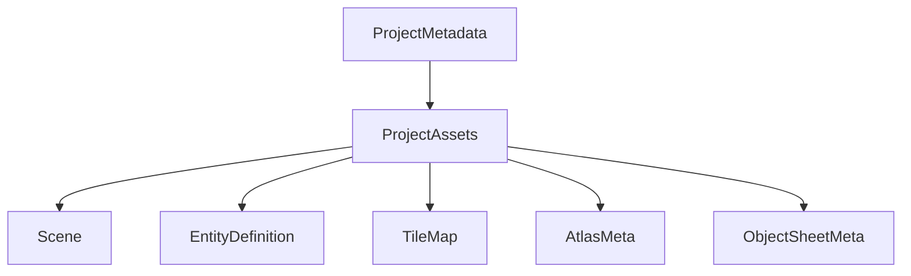

Key authored asset meanings:

| Model | Meaning |
|---|---|
| `ProjectMetadata` | project-level metadata, runtime splash and audio mix, editor recents/layouts |
| `ProjectAssets` | discovered asset inventory used by editor tooling |
| `Scene` | scene composition: map references, scene entities, scene rules, optional camera overrides |
| `EntityDefinition` | reusable entity archetype: category, visuals, defaults, audio defaults |
| `TileMap` | tile grid plus persisted map-owned object instances |
| `AtlasMeta` | named tile metadata including solid/trigger flags and UV layout |
| `ObjectSheetMeta` | named placeable static object definitions extracted from a sprite sheet |

### 5.2 Entity model

The entity model separates identity from behavior.

Important concepts:

| Concept | Owned by | Meaning |
|---|---|---|
| `category` | `EntityDefinition` / `Entity` | generic authored taxonomy such as human or creature |
| `EntityKind` | runtime `Entity` | internal runtime mechanics classification |
| `control_role` | scene entity / runtime `Entity` | whether a placed entity is the current player character |
| `movement_profile` | entity attributes | how an entity responds to input |
| `ai_behavior` | entity attributes | autonomous behavior such as wander |

This separation matters:

- a creature can be player-controlled
- a human can be AI-controlled
- movement behavior is not equivalent to player identity
- runtime player semantics derive from `control_role`, not from authored category

### 5.3 Map model

`TileMap` owns both terrain tiles and static map objects.

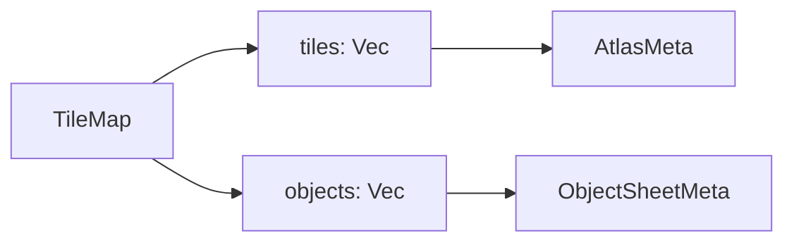

`MapObjectInstance` currently stores:

- `sheet`
- `object_name`
- `position`
- `size_px`
- `visible`
- `solid`

This means map objects are persisted as part of the map asset, not as scene entities.

### 5.4 Audio model

Audio has three layers of control:

| Layer | Examples |
|---|---|
| project-wide mix | master, music, movement, collision |
| entity defaults | movement sound, collision sound, hearing radius, trigger mode |
| scene/map runtime events | actual `AudioEvent::PlaySound` or `BackgroundMusic` dispatch |

Movement audio can be emitted from multiple sources:

- direct input-driven movement
- AI wander movement
- rule-driven velocity movement
- animation-loop-triggered locomotion events

Per-entity audio configuration:

| Setting | Purpose |
|---|---|
| `movement_sound` | sound ID to play during movement |
| `movement_sound_trigger` | `Distance` (every N pixels) or `AnimationLoop` (on animation frame completion) |
| `footstep_trigger_distance` | distance threshold for distance-based triggers (default: 32.0) |
| `collision_sound` | sound ID for collision events |
| `hearing_radius` | spatial attenuation radius in pixels (default: 192) |

Spatial attenuation is listener-relative and currently uses the current player position as the listener.

### 5.5 Rules model

Rules enable scene-specific behaviors without code changes. Each scene can define rules that respond to triggers and execute actions.

| Component | Purpose |
|---|---|
| `Rule` | named rule with trigger, conditions, actions, priority, and one-time flag |
| `RuleTrigger` | event that activates the rule |
| `RuleCondition` | prerequisite checks before action execution |
| `RuleAction` | effect to apply when rule fires |

Supported triggers:

- `OnStart` - scene initialization
- `OnUpdate` - every frame
- `OnPlayerMove` - player movement input
- `OnKey { key }` - specific key press
- `OnCollision` - entity collision event
- `OnDamaged` - entity receives damage
- `OnDeath` - entity health reaches zero
- `OnTrigger` - trigger zone activation

Supported actions:

- `PlaySound { channel, sound_id }` - play sound effect
- `PlayMusic { track_id }` - switch background music
- `PlayAnimation { target, state }` - change entity animation
- `SetVelocity { target, velocity }` - apply movement velocity
- `Spawn { entity_type, position }` - create new entity
- `DestroySelf { target }` - remove entity
- `SwitchScene { scene_name }` - transition to another scene

Rules execute in priority order and can be marked `once: true` to fire only on first trigger.

### 5.6 Menu model

The menu system is project-configurable and supports runtime customization.

| Component | Purpose |
|---|---|
| `MenuSettings` | root menu configuration in `project.toml` |
| `MenuAppearance` | visual styling (fonts, colors, spacing, opacity, borders) |
| `MenuScreenDefinition` | screen layout with title, entries, and bindings |
| `MenuDialogDefinition` | modal dialog definitions |
| `MenuBorderStyle` | rendering style for menu borders |
| `UiAction` / `UiCommand` | generic interaction model shared by screens and dialogs |

Appearance settings include:

- font family and size
- five color values (border, text, three backgrounds)
- transparent background toggles
- menu dimensions (width/height percent)
- spacing values (title, button, footer)
- opacity and border style

Menu/dialog rendering is intentionally shared across runtime and editor:

- menu and dialog definitions live in `toki-core::menu`
- generic UI blocks live in `toki-core::ui`
- runtime and editor both compose those definitions into `UiComposition`
- dialogs and screens emit generic `UiAction` values rather than menu-specific commands

## 6. Dynamic View

### 6.1 Runtime startup

Runtime supports both project-directory and packed-bundle startup.

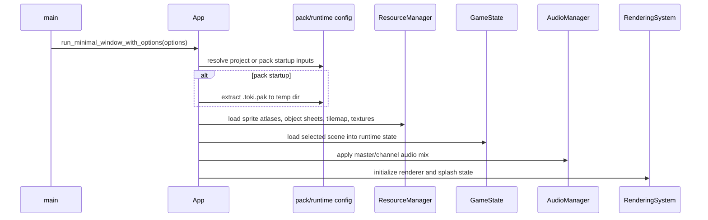

Important runtime properties:

- startup is scene/map driven, not only demo-driven
- object sheets are loaded separately from sprite atlases
- derived `TOKI_VERSION` is logged at startup and shown on the splash screen

### 6.2 Runtime frame loop

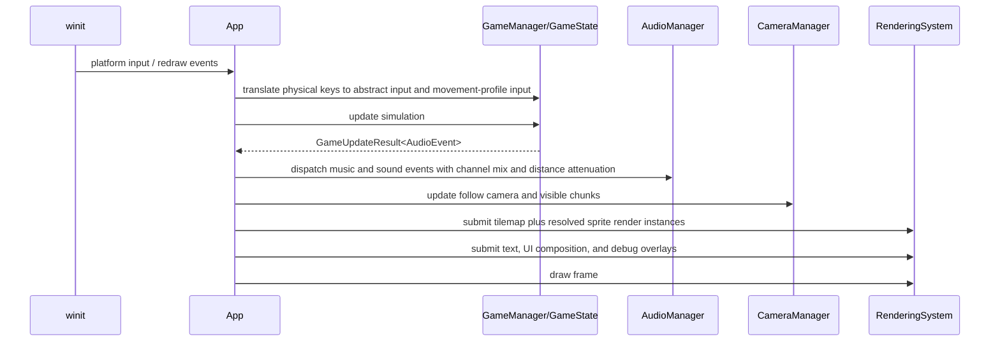

Behavioral notes:

- all movement paths use shared collision gates
- solid map objects, solid entities, and solid tiles all participate in blocking
- left-facing directional animation uses render-time flip state rather than duplicated art
- map-owned object-sheet instances render in runtime as part of the map
- runtime and editor both use the shared sprite-render request pipeline for world sprites
- runtime menus and dialogs render through the shared UI composition path rather than a menu-specific renderer

Timing modes:

The runtime supports two timing modes configured in `project.toml`:

| Mode | Update path | Behavior |
|---|---|---|
| `Fixed` (default) | `GameState::update()` | 60 FPS fixed timestep (16.67ms per tick) |
| `Delta` | `GameState::update_with_delta(delta_ms)` | variable timestep with frame-rate scaling |

In delta mode, movement speeds and animation deltas scale proportionally to elapsed time. Movement uses sub-pixel accumulation per axis with sign-flip reset on direction change.

### 6.3 Editor project-open flow

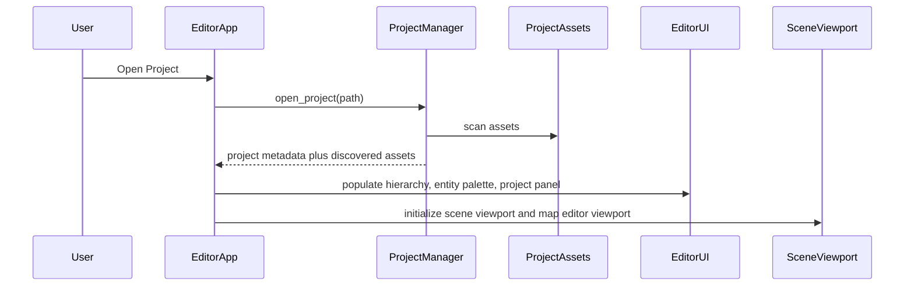

### 6.4 Scene workflow

The scene workflow is scene-centric.

Main responsibilities:

- choose active scene
- choose maps referenced by that scene
- place and move scene entities
- edit entity/scene properties and rules
- preview runtime-style rendering through the scene viewport

Scene flow:

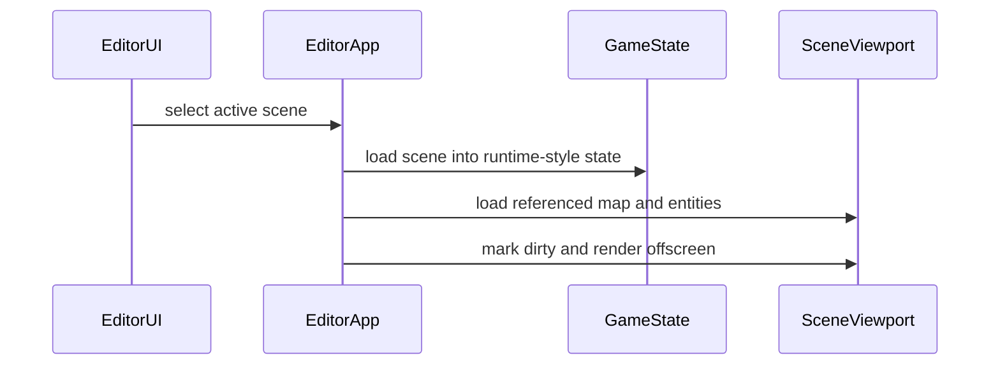

### 6.5 Map editor workflow

The map editor is asset-centric and intentionally independent of the active scene.

Main responsibilities:

- create map drafts in memory
- load existing map assets directly
- paint/fill/pick tiles
- place, move, inspect, and delete map-owned objects
- save back to `assets/tilemaps/*.json`
- maintain its own undo/redo history

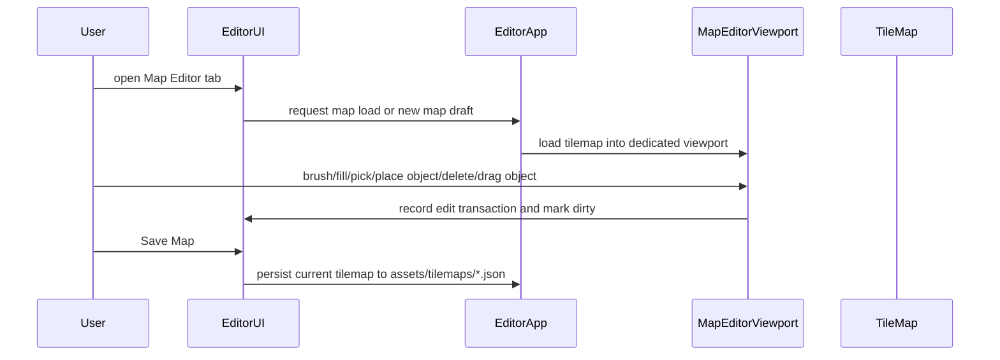

Current map-editor tools:

- `Drag`
- `Brush`
- `Fill`
- `Pick Tile`
- `Place Object`
- `Delete`

### 6.6 Inspector and project panel workflow

The right-side panel has two distinct responsibilities:

- `Inspector`: selection-driven editing of the current selection (entity, scene, map object, menu surface, menu entry)
- `Project`: project-wide settings (metadata, splash duration, audio mixer, display settings)

### 6.7 Runtime menu and dialog workflow

The runtime menu flow is project-authored but executed through shared core types.

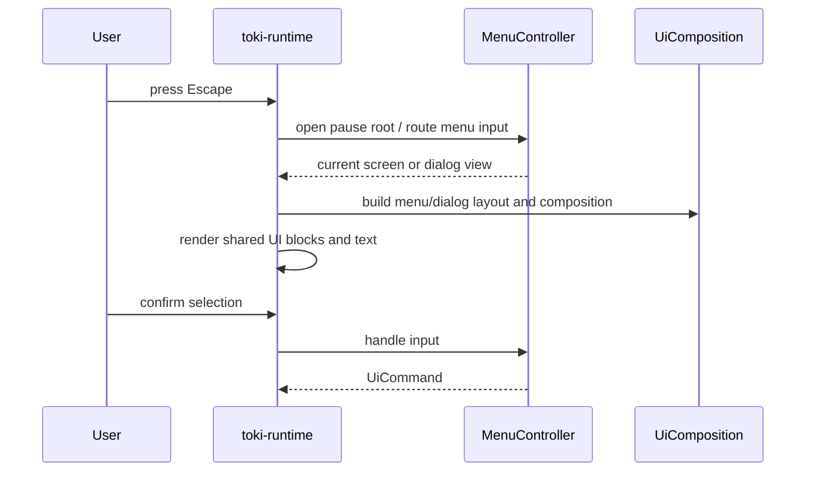

Current properties:

- project menus are authored in `project.toml`
- the editor previews those menus through the same layout/composition logic used by runtime
- confirmation dialogs are authored separately from menu screens but use the same action model
- runtime currently consumes `UiCommand::ExitRuntime` directly and queues `UiCommand::EmitEvent` for downstream consumers

## 7. Layering Rules and Architectural Invariants

### 7.1 Layering rules

1. Schemas define serialized shape only.
2. Project assets define authored content only.
3. `toki-core` defines runtime meaning and simulation rules.
4. `toki-render` consumes prepared render data, not raw project files.
5. Runtime and editor may orchestrate core/render differently, but they must not redefine core semantics.
6. Scene composition and map editing are separate workflows even when they share rendering code.

### 7.2 Invariants

| Invariant | Definition | Enforced by |
|---|---|---|
| I1 | canonical JSON schemas come from one place only | `toki-schemas` |
| I2 | runtime truth lives in `GameState` / `EntityManager`, not in UI or renderer | `toki-core/src/game/`, `toki-core/src/entity.rs` |
| I3 | player identity derives from `control_role`, not authored category | scene loading and entity manager player tracking |
| I4 | movement behavior derives from `movement_profile`, not player identity | `GameState` input routing |
| I5 | autonomous behavior derives from `ai_behavior`, not category alone | `GameState::update_npc_ai` path |
| I6 | map objects belong to the map asset, not to the scene entity list | `TileMap::objects`, map-editor persistence |
| I7 | editor placement/drag validation uses the same collision semantics as runtime movement | `toki-core/src/collision.rs`, editor interaction modules |
| I8 | runtime/editor rendering consume renderer-ready snapshots and metadata, not raw project documents directly | `SceneViewport`, runtime rendering system |

## 8. Known Seams and Current Debt

The architecture is coherent, but a few seams are still visible and should remain explicit.

### 8.1 Duplicate resource-manager ownership

There are still two `ResourceManager` implementations in the workspace:

- `toki-core::resources::ResourceManager`
- `toki-runtime::systems::resources::ResourceManager`

This is the main remaining resource-loading debt. The runtime manager owns the richer multi-atlas/object-sheet path, while the core manager still exists and is used by editor-facing code. The duplication is narrower than before, but authority is not yet fully unified.

### 8.2 Render entrypoint split

Rendering is still shared across two orchestration styles:

- `SceneRenderer` for editor/offscreen composition
- `GpuState` for runtime-direct rendering

Recent refactors reduced duplication by moving sprite extraction into `toki-core::sprite_render` and menu/dialog composition into `toki-core::ui`, but tilemap/offscreen orchestration and some backend-specific state still remain split.

### 8.3 Validation depth

Schema validation exists and is useful, but deeper semantic validation remains limited. Examples of future semantic checks:

- missing atlas tile names referenced by maps
- missing object-sheet object names referenced by map objects
- stale entity definition references in scenes
- cross-asset validation of animation clip frame names

### 8.4 Runtime/editor object editing asymmetry

Map objects are fully editable in the map editor and render in runtime, but scene-viewport editing of map objects is still behind scene-entity editing in ergonomics.

### 8.5 Scene-path authority mismatch

Project metadata supports explicit scene-path mapping in `project.toml`, but runtime startup still resolves scenes through the canonical `scenes/{name}.json` path. This works for convention-following projects, but it is still a correctness gap between editor/project metadata and runtime bootstrap.

## 9. Build, Test, and Release Architecture

The workspace is built and released as a coordinated multi-crate system.

Primary quality surfaces:

- `cargo fmt --all --check`
- `cargo clippy --workspace --all-targets -- -D warnings`
- `cargo test --workspace`
- `just coverage`
- CI workflows in `.github/workflows`

Release structure:

- shared workspace versioning in root `Cargo.toml`
- changelog-driven release prep in `CHANGELOG.md`
- build scripts in editor/runtime derive `TOKI_VERSION`
- derived version displayed in splash screen and startup logs

## 10. Architecture Summary

The architecture consists of six layers:

1. **Schema layer** (`toki-schemas`) - canonical JSON schema definitions
2. **Persistence layer** - `project.toml`, scene/entity/map/atlas JSON files
3. **Core domain layer** (`toki-core`) - simulation, collision, rules, entity management
4. **Render infrastructure layer** (`toki-render`) - WGPU pipelines, text layout, render targets
5. **Runtime shell** (`toki-runtime`) - game execution, audio playback, input handling
6. **Editor shell** (`toki-editor`) - project management, scene/map editing, asset inspection

Key architectural decisions:

- `control_role`, `movement_profile`, `ai_behavior`, and `category` are independent concerns
- map editing operates on map assets directly, separate from scene editing
- tile atlases and object sheets are distinct asset types
- project-level configuration (audio, display, menu) is separate from scene/entity settings
- runtime accepts both project directories and packed bundles
- `GameState` is modularized into focused submodules (movement, combat, rules, scene, input)
- timing supports fixed timestep (60 FPS) or delta-scaled modes
- rules system enables declarative scene behaviors without code changes
- runtime and editor now share menu/dialog composition and sprite-render request resolution through `toki-core`
