# Software Design and Architecture Description (SDD/SAD)
## Project: `ToKi`

## 1. Purpose

This document describes the implemented design of `ToKi` for engineering and maintenance audiences. It is written as a development-facing architecture description, with explicit attention to layering, ownership boundaries, and the difference between design-time editor data and runtime game state.

The main readers are:

- developers extending engine systems, renderer behavior, or editor workflows
- maintainers reviewing refactors for architectural consistency
- contributors aligning roadmap documents with the actual repository state

The core promise of `ToKi` is that a Game Boy-style 2D workflow can be built from a small set of explicit layers:

- schema-owned asset definitions
- shared core domain models and simulation logic
- a reusable renderer
- a runtime shell
- an editor shell

This document is intentionally split into a static view and a dynamic view:

- static view: crates, modules, boundaries, models, and architectural invariants
- dynamic view: runtime loop behavior, editor workflows, and state transitions

The document reflects the repository state as of `0.0.12`, not just the planning material in `toki_orga`.

## 2. System Context

`ToKi` is a local-first 2D game-engine workspace for authoring and running Game Boy-style top-down games. It currently exposes two primary executable surfaces:

- `toki-editor`: GUI project editor, scene hierarchy, viewport, inspector, asset validation
- `toki-runtime`: runtime window and game loop for engine behavior and renderer integration

Supporting crates provide the shared substrate:

- `toki-core`: domain models, simulation, assets, collision, animation, scene management
- `toki-render`: WGPU pipelines, render targets, scene rendering abstractions
- `toki-schemas`: canonical JSON schemas for scenes, entities, atlases, and tilemaps

High-level workflow:

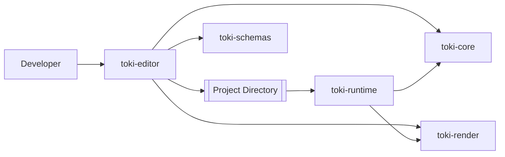

Primary asset and project surfaces:

- `project.toml`: project metadata and editor settings
- `scenes/*.json`: design-time scene definitions
- `assets/tilemaps/*.json`: tilemap definitions
- `assets/sprites/*.json`: sprite atlas metadata
- `entities/*.json`: entity definitions used for placement/spawning
- `assets/audio/**/*`: music and sound effects discovered by the editor
- `toki_editor_config.json`: editor-local UI and project-path configuration

Current product boundary:

- project creation, opening, saving, asset scanning, manual validation, scene loading, viewport rendering, entity placement, move-drag, and inspector-based property editing are implemented
- export/distribution tooling and visual scripting are still roadmap items
- runtime startup is still demo-oriented rather than fully project-driven

## 3. Architectural Style

The implementation follows a layered style with a strong design-time/runtime split. Data definitions live at the bottom, rendering infrastructure sits above shared domain logic, and application-specific orchestration lives in runtime and editor shells.

Architectural characteristics:

- explicit separation between persisted scene data (`Scene`, `ProjectAssets`) and live runtime state (`GameState`, `EntityManager`)
- JSON-first asset model with schema ownership isolated in `toki-schemas`
- reusable rendering primitives shared between editor and runtime
- deterministic update order in runtime systems
- editor interaction logic separated into focused modules (`selection`, `placement`, `camera`)
- local filesystem as the primary persistence and asset-discovery boundary

### 3.1 Quality attributes and acceptance criteria

| Quality attribute | Operational interpretation | Acceptance criteria | Primary evidence |
|---|---|---|---|
| Pixel-accurate rendering | World state is rendered with integer-aligned coordinates and nearest-neighbor presentation | camera, sprite placement, and projection logic preserve 160x144-native behavior | `crates/toki-core/src/camera.rs`, `crates/toki-core/src/math/projection.rs`, `crates/toki-render/src/*` |
| Shared engine reuse | Editor and runtime consume the same core models instead of duplicating gameplay logic | scene entities, collisions, animation, and sprite frames come from `toki-core` | `crates/toki-core/src/game.rs`, `crates/toki-editor/src/scene/viewport.rs`, `crates/toki-runtime/src/systems/game_manager.rs` |
| Editor safety | Editing operations mutate design-time scene data intentionally and can be re-synced into runtime state | inspector edits, entity placement, and drag-move affect scene definitions and trigger viewport reloads | `crates/toki-editor/src/ui/inspector.rs`, `crates/toki-editor/src/ui/interactions/*`, `crates/toki-editor/src/editor_app.rs` |
| Asset validity | Asset formats are centrally defined and validated against canonical schemas | validator compiles schemas from a single source of truth and checks project assets by type | `crates/toki-schemas/src/lib.rs`, `crates/toki-editor/src/validation.rs` |
| Modularity and testability | Major concerns can be reasoned about and tested in isolation | core logic and editor interactions have focused tests and module boundaries | `crates/toki-core/tests/*`, in-module tests in editor interaction/inspector/app modules |
| Release hygiene | Builds, checks, coverage, packaging, and release flow are standardized at workspace level | `just`, CI, changelog, package-crate, and release config all operate at workspace scope | `Justfile`, `.github/workflows/rust.yml`, `Cargo.toml`, `CHANGELOG.md` |

### 3.2 Key architecture decisions and trade-offs

| Decision | Why this was chosen | Trade-off accepted | Current consequence |
|---|---|---|---|
| Separate `Scene` from `GameState` | Editor persistence and runtime execution have different lifecycle needs | explicit conversion/reload steps are required | active-scene loading copies entities from scene data into runtime state |
| Keep schema payloads in `toki-schemas` | asset validation must have a single source of truth | one more crate in workspace | editor validation is packaging-safe and schema drift is avoided |
| Use a custom entity manager instead of a generic ECS framework | data model stays explicit and small for current engine scope | less generic query composition than a full ECS | entity/type/audio handling stays straightforward but hand-managed |
| Share rendering concepts but keep two rendering entrypoints | editor needs offscreen texture rendering while runtime still uses a direct window path | `SceneRenderer` and `GpuState` coexist | renderer layering is usable but not yet fully consolidated |
| Put editor interaction logic into dedicated modules | click, drag, move, and placement rules needed to stay testable and readable | more coordination code between UI state and viewport state | selection, placement, and camera behavior are easier to extend without monolithic UI code |
| Load assets from filesystem paths at application edges | engine/editor remain local-first and transparent | runtime bootstrap still depends on hardcoded/default paths | project-driven runtime startup is not complete yet |

## 4. Static View

The static view captures compile-time structure across the workspace. The important boundary is not just crate-to-crate dependency; it is authority: schemas define valid documents, core owns game-state truth, render owns GPU execution, runtime owns OS-loop coordination, and editor owns design-time workflows.

### 4.1 High-level dependency graph

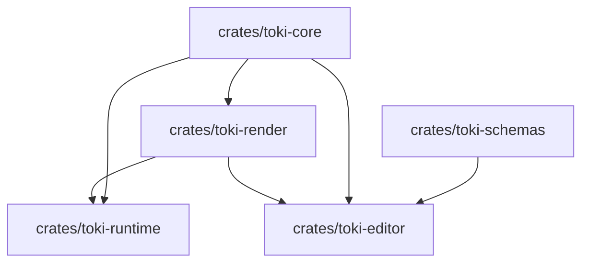

Implementation note:

- the editor manifest currently depends on `toki-runtime`, but source-level editor code primarily talks directly to `toki-core`, `toki-render`, and `toki-schemas`
- this means the conceptual layering is cleaner than the manifest graph suggests

### 4.2 Layered decomposition by authority

| Layer | Crates and main files | Responsibility | Boundary |
|---|---|---|---|
| Schema layer | `crates/toki-schemas/src/lib.rs`, `crates/toki-schemas/schemas/*.json` | canonical JSON schema ownership | defines valid document structure; no runtime/editor orchestration |
| Core domain layer | `crates/toki-core/src/{game,entity,scene,scene_manager,collision,animation,resources,serialization}.rs` | asset models, entity definitions, runtime state, simulation, collision, scene conversion, persistence helpers | authoritative gameplay/data semantics |
| Render infrastructure layer | `crates/toki-render/src/{scene,gpu,targets,pipelines/*}.rs` | WGPU setup, render pipelines, offscreen/window targets, scene rendering | GPU execution and render-specific data transformation only |
| Runtime application layer | `crates/toki-runtime/src/{app.rs,systems/*}` | OS event loop, system coordination, demo bootstrap, frame timing, audio and camera integration | translates platform events into core/runtime behavior |
| Editor application layer | `crates/toki-editor/src/{editor_app.rs,project/*,scene/*,ui/*,validation.rs}` | project IO, asset scanning, viewport orchestration, selection/placement/inspector workflows, schema validation | design-time user workflows and persistence |

### 4.3 Crate-level responsibilities

#### `toki-schemas`

`toki-schemas` is intentionally small. It embeds the canonical schema payloads with `include_str!` and exposes them as constants through `SCHEMA_FILES`.

Responsibility:

- own schema source-of-truth for `scene`, `entity`, `atlas`, and `map`
- provide packaging-safe schema access for tools and editor validation

It does not:

- validate files itself
- perform project scanning
- own any runtime/editor logic

#### `toki-core`

`toki-core` is the main domain crate. It contains both persisted models and live runtime models.

Key modules:

| File | Responsibility |
|---|---|
| `src/entity.rs` | `Entity`, `EntityManager`, `EntityDefinition`, audio components, definition-to-entity conversion |
| `src/game.rs` | `GameState`, input handling, scene loading, entity sync, renderable entity queries, debug data extraction |
| `src/scene.rs` | design-time scene document model |
| `src/scene_manager.rs` | scene registry and active-scene selection |
| `src/collision.rs` | tile/entity collision utilities and placement checks |
| `src/animation.rs`, `src/sprite.rs` | clip/state/frame selection logic |
| `src/camera.rs` | camera state, follow behavior, projection, bounds clamping |
| `src/resources.rs` | shared/default asset loading utilities |
| `src/serialization.rs` | save/load helpers for entities, scenes, and game state |
| `src/assets/{atlas,tilemap}.rs` | asset formats, validation, vertex generation support |

Authority rules:

- `EntityDefinition` owns transformation from JSON definition to runtime `Entity`
- `GameState` owns scene-to-runtime entity materialization
- collision helpers in core are reused by both runtime movement and editor placement validation

#### `toki-render`

`toki-render` owns WGPU-specific concerns and render-target abstraction.

Key modules:

| File | Responsibility |
|---|---|
| `src/scene.rs` | `SceneRenderer`, `SceneData`, debug-shape and sprite-scene projection |
| `src/targets.rs` | `RenderTarget`, `WindowTarget`, `OffscreenTarget` |
| `src/gpu.rs` | direct runtime-oriented GPU state (`GpuState`) |
| `src/pipelines/{tilemap,sprite,debug}.rs` | concrete render pipelines |
| `src/wgpu_utils.rs` | device/surface setup helpers |

Important current condition:

- `SceneRenderer` is the reusable abstraction used by the editor viewport
- `GpuState` is still the direct renderer used by runtime systems
- that is a valid transitional architecture, but it means render ownership is split between a newer target-agnostic path and an older direct state path

#### `toki-runtime`

`toki-runtime` is the runtime shell around `toki-core` and `toki-render`.

Key modules:

| File | Responsibility |
|---|---|
| `src/app.rs` | winit app lifecycle, startup/bootstrap, per-frame tick and render loop |
| `src/systems/game_manager.rs` | translation between platform key input and core `GameState` |
| `src/systems/camera_manager.rs` | camera following and visible-chunk caching |
| `src/systems/rendering.rs` | runtime render coordination and projection updates |
| `src/systems/audio_manager.rs` | audio event consumption |
| `src/systems/performance.rs` | frame/performance statistics |
| `src/systems/platform.rs` | window/platform lifecycle handling |
| `src/systems/resources.rs` | runtime-local asset loading wrapper |

Current runtime boundary:

- runtime starts from hardcoded/default resources and spawns a player plus demo NPC in `App::new`
- it does not yet boot from a saved editor project or selected scene file

#### `toki-editor`

`toki-editor` is the design-time application shell. It owns persistence, project structure, UI state, viewport workflows, and manual validation.

Key modules:

| File | Responsibility |
|---|---|
| `src/editor_app.rs` | top-level editor orchestration, event loop, project requests, active-scene loading, viewport coordination |
| `src/project/manager.rs` | project create/open/save workflow |
| `src/project/assets.rs` | project asset discovery and asset inventory |
| `src/project/project_data.rs` | `project.toml` metadata model |
| `src/scene/manager.rs` | editor-side scene/game-state/tilemap wrapper |
| `src/scene/viewport.rs` | bridge from scene/game state to offscreen rendering, picking, preview rendering, dirty-state control |
| `src/ui/editor_ui.rs` | UI state model and panel orchestration |
| `src/ui/hierarchy.rs` | hierarchy/maps/entity palette presentation |
| `src/ui/inspector.rs` | scene/entity/map inspection and property editing |
| `src/ui/interactions/{selection,placement,camera}.rs` | click-select, drag-move, placement-preview, viewport-camera input logic |
| `src/validation.rs` | schema validation over discovered project assets |
| `src/config.rs` | editor-local config file handling |

### 4.4 Concrete model decomposition

The central model split is between persisted design data and executable runtime state.

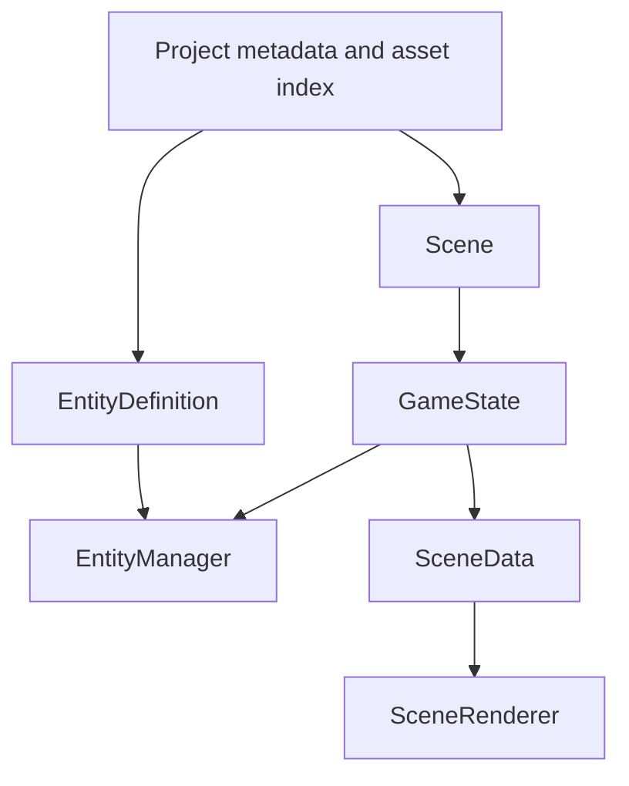

Main model roles:

| Model | Layer | Role |
|---|---|---|
| `Project` / `ProjectMetadata` | editor | persists project-level settings and scene path map |
| `ProjectAssets` | editor | discovered asset inventory keyed by asset type |
| `Scene` | core/editor | persisted scene document with maps, entities, and camera overrides |
| `EntityDefinition` | core | JSON-authored definition that creates runtime entities and audio/collision data |
| `Entity` / `EntityManager` | core | live runtime entities and typed/runtime lookup tables |
| `GameState` | core | active simulation state plus current-scene registry |
| `SceneData` | render | renderer-ready snapshot of tilemap, sprites, debug shapes, and visible chunks |

### 4.5 Project artifact model

The editor works against a project directory rather than an internal database.

Expected project structure:

```text
<project>/
  project.toml
  scenes/
    *.json
  entities/
    *.json
  assets/
    sprites/
      *.json
      *.png
    tilemaps/
      *.json
      *.png
    audio/
      music/*
      sfx/*
  settings/
```

Artifact semantics:

- scenes reference maps by name, not by embedded map payload
- maps are loaded separately into the editor viewport
- entity definitions are separate authored assets used for placement and spawning
- schema validation is opt-in/manual, triggered from the editor
- the editor expects an `entities/` directory for definition discovery, but current new-project scaffolding does not create that directory yet

### 4.6 Layering rules and current boundary conditions

The layering is mostly coherent, but the current codebase still shows a few transitional seams that matter for future work.

Clean boundaries:

- schema definitions live in one place only
- simulation logic lives in `toki-core`
- editor-specific interaction state is not pushed down into core
- render pipelines do not own gameplay logic

Transitional boundaries:

- `toki-core::ResourceManager` and `toki-runtime::systems::resources::ResourceManager` overlap in responsibility
- `toki-render::GpuState` and `toki-render::SceneRenderer` overlap in render orchestration level
- runtime bootstrap is still hardcoded/demo-oriented instead of project-scene-oriented
- build scripts inject `TOKI_VERSION`, but current application code does not visibly surface that value yet

These are not correctness bugs by themselves, but they are architectural debt that should be kept explicit.

## 5. Dynamic View

The dynamic view focuses on implemented flows: runtime update/render, editor startup, project loading, inspector editing, entity placement/movement, and asset validation.

### 5.1 Runtime boot and frame loop

Runtime startup sequence:

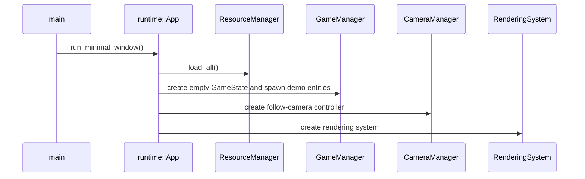

Per-frame runtime behavior:

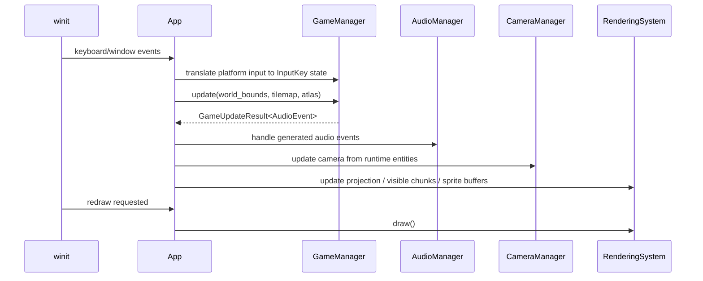

Behavioral notes:

- runtime updates gameplay first, then camera, then render data
- debug collision rendering is generated from `GameState` queries and rendered as overlay shapes
- save/load shortcuts (`F5`, `F6`) serialize `GameState` directly

### 5.2 Editor startup and viewport initialization

Editor startup sequence:

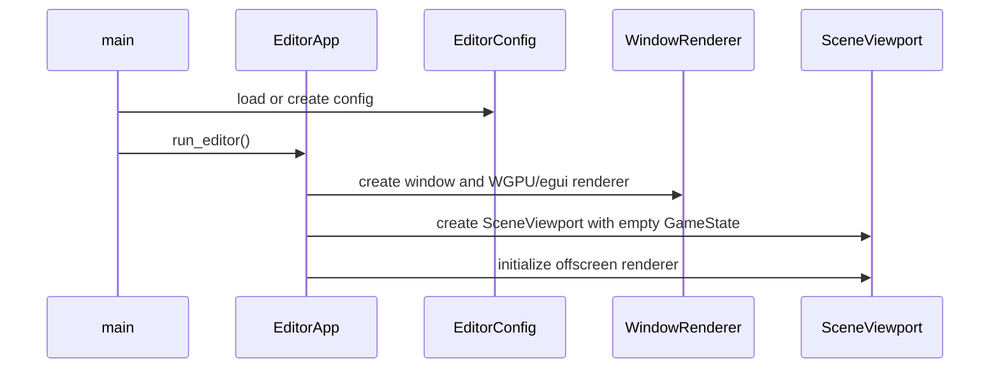

Important runtime/editor split:

- the editor does not simulate the game continuously like runtime
- the viewport only re-renders when marked dirty
- offscreen rendering is performed before egui panel composition, then displayed as a texture in the viewport panel

### 5.3 Project open and active-scene synchronization

Project-open and scene-load flow:

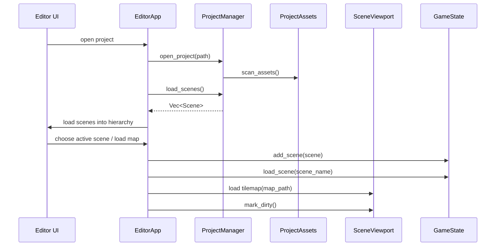

Architectural meaning:

- scene documents are loaded into editor UI state first
- the active scene is then copied into `GameState` for runtime-style rendering and picking
- tilemaps are managed separately from scene entity loading

This separation is intentional, but it means scene changes must be propagated explicitly. The code does that through `scene_content_changed`, `last_loaded_active_scene`, and viewport dirty-state tracking.

### 5.4 Inspector property editing sequence

Inspector editing flow:

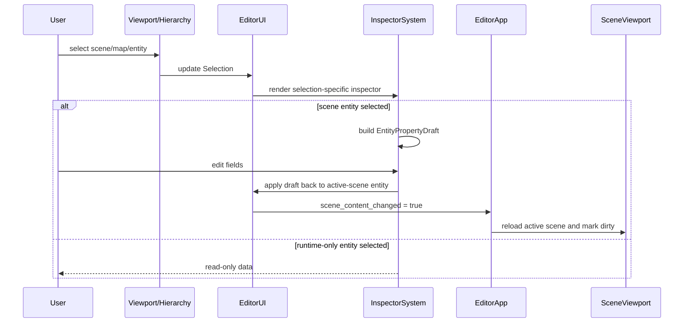

Current inspector behavior:

- scene entities are editable
- runtime-only entities are shown read-only
- edited properties include position, size, visibility, active/solid flags, movement, inventory, speed, render layer, optional health, and collision-box fields

This satisfies the current "property editing (inspector)" milestone in a scene-authoring sense, but not yet as a fully generic property-grid framework.

### 5.5 Entity placement and drag-move sequence

Placement and move behavior is one of the clearest examples of editor/runtime model cooperation.

Placement flow:

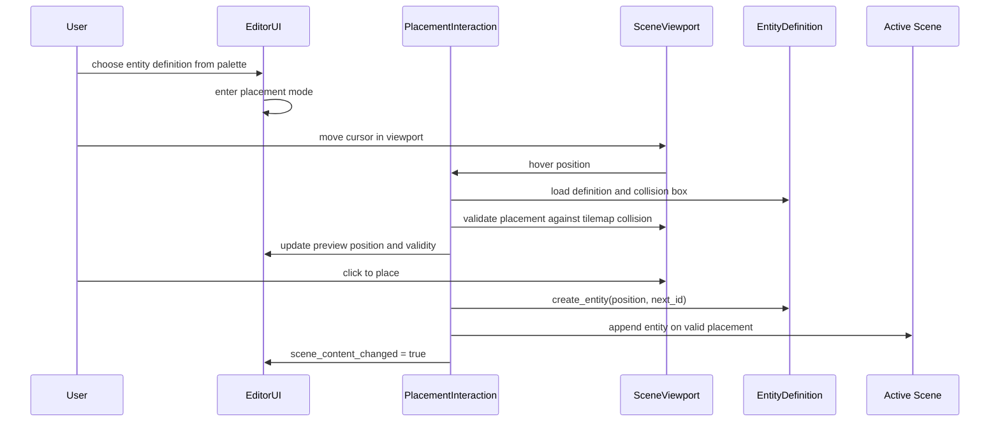

Move-drag flow:

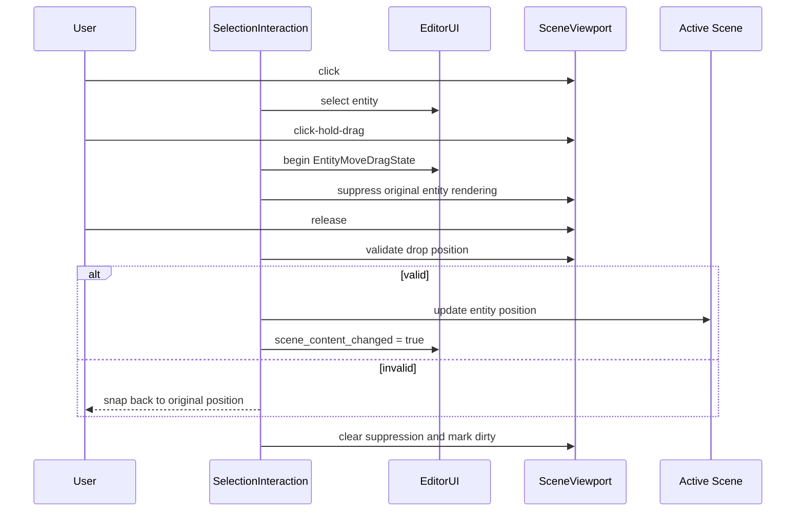

Implemented interaction rule:

- single click selects and updates the inspector
- click-hold-drag starts move mode if the drag began on an entity
- release attempts drop
- invalid drop snaps back to original position and exits drag mode

### 5.6 Asset validation flow

Validation sequence:

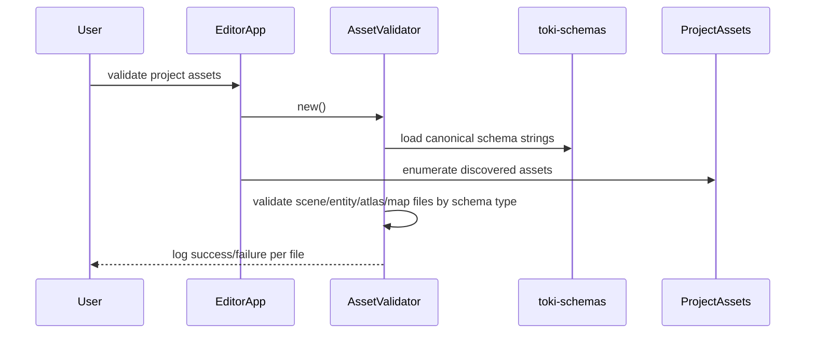

This is schema validation only. It does not yet perform deeper semantic consistency checks across assets, such as verifying that every scene-referenced map or every animation atlas name resolves to a discovered asset.

## 6. UI Interaction Model

The editor UI is a stateful egui shell with explicit panels and selection state.

Major surfaces:

- hierarchy/maps/entity palette panel
- central viewport panel
- inspector panel
- console/log panel
- top menu

Primary selection states:

- `Scene`
- `Map(scene, map)`
- `Entity`
- `StandaloneMap`
- `EntityDefinition`

Important interaction properties:

- `F1` toggles hierarchy
- `F2` toggles inspector
- `F4` toggles collision debug rendering in viewport/game state
- `Escape` exits the editor
- viewport click selects entities by bounds hit-testing
- viewport drag pans camera unless an entity move-drag is active
- placement mode shows a preview sprite plus validity outline

Current UI-state machine, simplified:

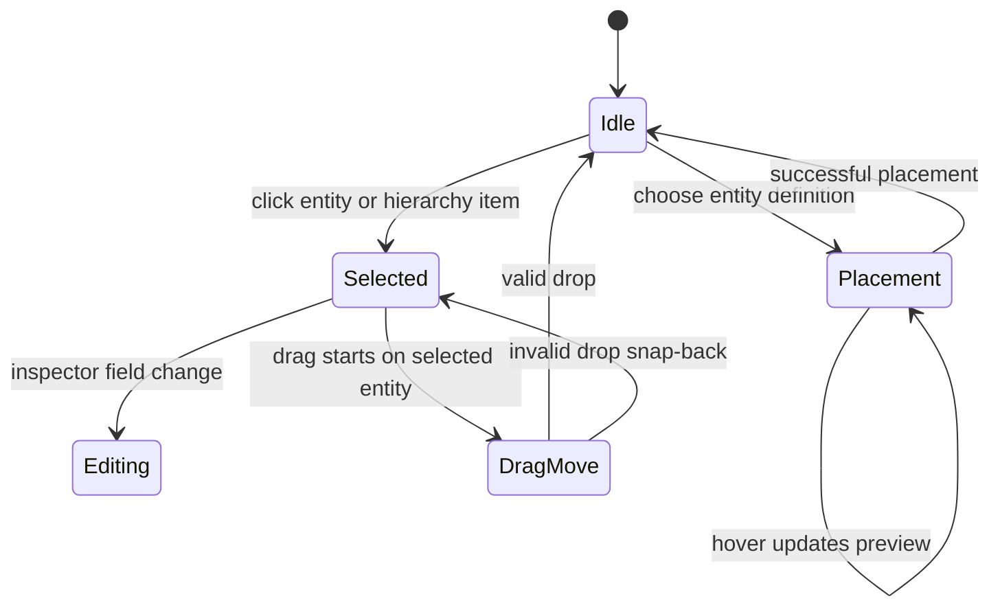

## 7. Guarantees and Current Limits

### 7.1 Guarantees

- schemas are defined in a single dedicated crate and consumed by the validator without duplication
- scene entities can be authored, placed, moved, selected, and edited through the editor
- collision placement checks are shared between runtime movement rules and editor placement rules
- editor viewport rendering and runtime rendering share pipeline concepts and core sprite/tilemap data
- active-scene loading into `GameState` is explicit and test-covered for map-selection edge cases
- workspace-level CI, clippy, formatting, testing, coverage, license checks, packaging, and release flow are in place

### 7.2 Current limits

- runtime startup is still sample/demo oriented, not yet a full project runner
- resource loading responsibility is duplicated between `toki-core` and `toki-runtime`
- render orchestration exists in both `GpuState` and `SceneRenderer`
- schema validation is manual and file-structural; it is not yet a full semantic validation pipeline
- property editing currently targets scene entities, not an extensible reflection-style property system
- entity picking is bounds-based, not render-buffer/GPU-based
- project scaffolding is not yet fully aligned with all later editor expectations (`entities/` is assumed by discovery and placement flows)
- export/build-for-game distribution remains a future feature
- build scripts compute `TOKI_VERSION`, but the applications do not yet prominently surface it

### 7.3 Architectural invariants

| Invariant | Definition | Enforced by |
|---|---|---|
| I1 | canonical asset schemas come from one source only | `toki-schemas` plus `AssetValidator` |
| I2 | runtime entity truth lives in `GameState` / `EntityManager`, not in renderer or UI | `toki-core/src/game.rs`, `toki-core/src/entity.rs` |
| I3 | design-time scene edits must propagate by explicit scene reload/dirty-state logic | `editor_app.rs`, `scene/viewport.rs`, `ui/inspector.rs` |
| I4 | placement and move validation use the same collision semantics as runtime movement | `toki-core/src/collision.rs`, editor interaction modules |
| I5 | renderer consumes prepared scene snapshots, not raw project files directly | `SceneViewport::prepare_scene_data`, `toki-render::SceneRenderer` |
| I6 | project persistence is filesystem-backed and transparent | `project/manager.rs`, `project/assets.rs`, `project/project_data.rs` |

## 8. Build, Test, and Release Architecture

The repository is organized as a workspace-first build and release system.

Build/test surfaces:

- `just build`
- `just run-editor`
- `just run-runtime`
- `just test`
- `just fmt-check`
- `just clippy`
- `just coverage`
- `just quality-licenses-check`
- `just quality-licenses-generate`

Release architecture:

- shared workspace version in root `Cargo.toml`
- `cargo-release` drives version bump, tag creation, and push behavior
- CI mirrors the `git-sync` multi-job structure with build, test, fmt, clippy, coverage, docs, package-crate, release, and pages deployment jobs
- `.crate` packaging is workspace-aware to support inter-crate path/version coupling

Version/build notes:

- workspace crates share version `0.0.12`
- `toki-editor` and `toki-runtime` build scripts derive `TOKI_VERSION` from `TOKI_VERSION_OVERRIDE`, `git describe`, or `CARGO_PKG_VERSION`
- project metadata stores `toki_editor_version` using `CARGO_PKG_VERSION`

Current state note:

- version injection infrastructure is present, but version display is not yet a prominent runtime/editor UX feature

## 9. Architecture Summary

`ToKi` currently has a sound high-level shape:

- schema ownership is centralized
- core domain logic is shared
- the editor and runtime are separated cleanly at application level
- the editor's recent work on selection, drag-move, and inspector editing fits the existing design rather than fighting it

The main architectural work still remaining is consolidation, not reinvention:

- unify overlapping resource-loading paths
- converge renderer entrypoints
- replace demo runtime bootstrap with project-driven startup
- deepen validation from schema-level correctness to cross-asset semantic correctness

That is a good sign. The current repository is past the "invent the architecture" phase and into the "tighten and simplify the architecture" phase.
