# Software Design and Architecture Description (SDD/SAD)
## Project: `ToKi`

## 1. Purpose

This document describes the implemented architecture of `ToKi` for engineering and maintenance work. It is grounded in the current repository state, not just the roadmap material. The focus is on clear ownership boundaries, especially the split between:

- authored project data
- shared simulation logic
- rendering infrastructure
- runtime orchestration
- editor orchestration

Primary readers:

- engine contributors extending simulation, rendering, or runtime bootstrap
- editor contributors extending project, scene, or map-authoring workflows
- maintainers reviewing whether new work respects existing layer boundaries

## 2. System Context

`ToKi` is a local-first 2D game-engine workspace for authoring and running Game Boy-style top-down games. It currently exposes two executable products:

- `toki-editor`: design-time GUI application for project, scene, map, entity, and object authoring
- `toki-runtime`: runtime application for loading a project or packed game, running the simulation, and presenting audio/video output

Supporting crates provide the shared substrate:

- `toki-schemas`: canonical JSON schema payloads
- `toki-core`: domain models, asset models, simulation, collision, scene/rule logic, serialization
- `toki-render`: reusable WGPU rendering infrastructure and text rendering
- `toki-test-fixtures`: shared test utilities and fixtures for unit/integration testing across crates

High-level context:

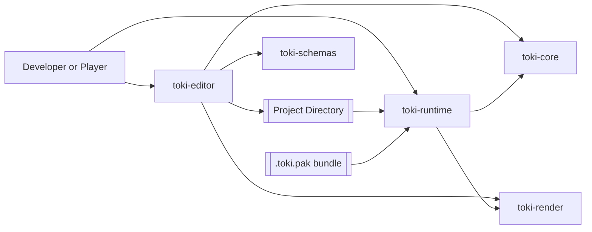
```mermaid
flowchart LR
    USER[Developer or Player]
    EDITOR[toki-editor]
    RUNTIME[toki-runtime]
    PROJECT[[Project Directory]]
    PACK[[.toki.pak bundle]]
    SCHEMAS[toki-schemas]
    CORE[toki-core]
    RENDER[toki-render]

    USER --> EDITOR
    USER --> RUNTIME
    EDITOR --> PROJECT
    EDITOR --> SCHEMAS
    EDITOR --> CORE
    EDITOR --> RENDER
    PROJECT --> RUNTIME
    PACK --> RUNTIME
    RUNTIME --> CORE
    RUNTIME --> RENDER
```

Main persisted surfaces:

- `project.toml`: project metadata, runtime settings (display, audio, splash, menu, timing mode, scene transitions)
- `scenes/*.json`: scene documents referencing maps and containing scene entities, rules, and dialog trees
- `entities/*.json`: entity definitions used for placement and spawning
- `assets/tilemaps/*.json`: tilemap assets with tile grid plus map-owned object instances
- `assets/sprites/*.json`: sprite atlases and object sheets
- `assets/palettes/*.json`: 4-color palette definitions for sprite recoloring
- `assets/audio/**/*`: music and sound effects (sfx/, music/ subdirectories)
- `toki_editor_config.json`: editor-local configuration outside project scope
- `runtime_config.json`: runtime-local persisted settings (audio mix, display) saved per project

## 3. Architectural Overview

The codebase follows a layered architecture with an explicit design-time/runtime split. The most important rule is that authority flows downward:

- schemas define valid serialized shapes
- project files define authored content
- core defines simulation meaning
- render defines GPU execution
- runtime and editor translate external events into core/render calls

### 3.1 Layer stack

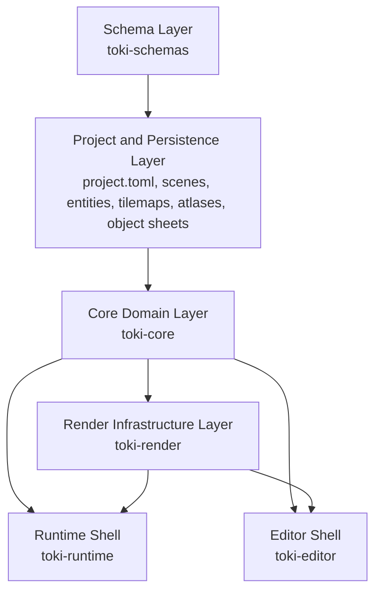
```mermaid
flowchart TD
    L1[Schema Layer<br>toki-schemas]
    L2[Project and Persistence Layer<br>project.toml, scenes, entities, tilemaps, atlases, object sheets]
    L3[Core Domain Layer<br>toki-core]
    L4[Render Infrastructure Layer<br>toki-render]
    L5[Runtime Shell<br>toki-runtime]
    L6[Editor Shell<br>toki-editor]

    L1 --> L2
    L2 --> L3
    L3 --> L4
    L3 --> L5
    L3 --> L6
    L4 --> L5
    L4 --> L6
```

### 3.2 Layer responsibilities

| Layer | Main artifacts | Responsibility | Must not own |
|---|---|---|---|
| Schema | `crates/toki-schemas/schemas/*.json` | Canonical document shapes | editor flow, runtime simulation |
| Project and persistence | `project.toml`, scene/entity/map/atlas/object-sheet JSON | Authored game content and settings | GPU logic, platform lifecycle |
| Core domain | `toki-core` | Asset models, runtime state, rules, collision, animation, serialization | egui, winit, WGPU orchestration |
| Render infrastructure | `toki-render` | Render targets, pipelines, scene snapshots, text layout | gameplay rules, project scanning |
| Runtime shell | `toki-runtime` | startup, resource loading, pack extraction, per-frame execution, audio dispatch | authoring workflows |
| Editor shell | `toki-editor` | project IO, asset scanning, inspector, scene viewport, map editor, validation | authoritative gameplay semantics |

### 3.3 Design-time/runtime split

The key architectural distinction is between authored content and executable state.

Design-time examples:

- `ProjectMetadata`
- `Scene`
- `EntityDefinition`
- `TileMap`
- `AtlasMeta`
- `ObjectSheetMeta`
- `DialogTree`
- `Palette4` (asset form)
- `RuleGraph` (editor-only visual representation)

Runtime examples:

- `GameState`
- `EntityManager`
- `Entity`
- `DialogController`
- `AiRuntimeState`
- `RuleRuntimeState`
- `EffectRuntimeState`
- `GameFlags`
- runtime audio components
- camera follow state
- render snapshots (`SceneData`, `SpriteInstance`, debug shapes)

The editor frequently converts design-time state into runtime-style state for preview and inspection, but the editor does not become the source of truth for simulation semantics. `toki-core` remains authoritative.

## 4. Static View

### 4.1 Workspace dependency view

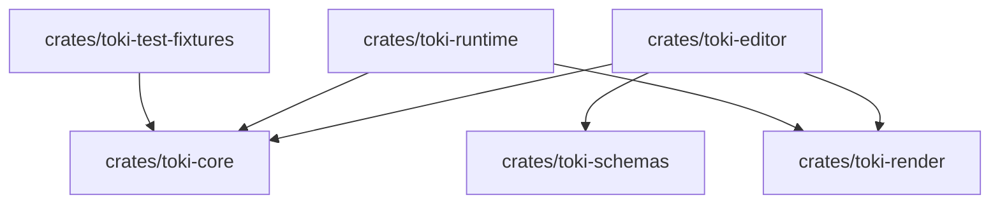
```mermaid
flowchart TD
    SCHEMAS[crates/toki-schemas]
    CORE[crates/toki-core]
    RENDER[crates/toki-render]
    RUNTIME[crates/toki-runtime]
    EDITOR[crates/toki-editor]
    FIXTURES[crates/toki-test-fixtures]

    EDITOR --> SCHEMAS
    EDITOR --> CORE
    EDITOR --> RENDER
    RUNTIME --> CORE
    RUNTIME --> RENDER
    FIXTURES --> CORE
```

Practical note:

- the editor depends conceptually on `toki-core`, `toki-render`, and `toki-schemas`
- the runtime depends on `toki-core` and `toki-render`
- `toki-test-fixtures` depends on `toki-core` and provides shared test builders and helpers
- project files and schema payloads are the shared contract between both applications

### 4.2 Crate-level decomposition

#### `toki-schemas`

Responsibilities:

- embed canonical schema payloads with `include_str!`
- expose `SCHEMA_FILES` for editor validation
- define the valid serialized shapes for:
  - `scene`
  - `entity`
  - `atlas`
  - `map`
  - `object_sheet`
  - `palette`

It intentionally does not:

- scan a project
- validate files itself
- know runtime/editor-specific workflows

#### `toki-core`

`toki-core` is the authoritative domain layer.

Key areas:

| File/module | Responsibility |
|---|---|
| `src/entity/` | runtime `Entity`, `EntityManager`, `EntityBuilder`, `EntityDefinition`, `EntityStorage`, sparse component storage, control roles, AI behavior, movement profiles, entity audio settings, stats, inventory, projectiles, tags |
| `src/game/` | modularized `GameState` with focused submodules (see below) |
| `src/game/rules/` | rule execution engine: trigger collection, condition evaluation, action buffering, command application, entity spawning, target resolution (see below) |
| `src/rules.rs` | rule data model: `Rule`, `RuleTrigger`, `RuleAction`, `RuleCondition`, `RuleTarget`, `RuleSet`, `TriggerContext` |
| `src/flags.rs` | `GameFlags` key-value store with `FlagValue` (Bool, Int, String) for persistent game state |
| `src/ai/` | autonomous entity behavior: `AiSystem`, behavior handlers (wander, chase, run-and-multiply), AI runtime state, separation logic |
| `src/dialog.rs` | `DialogTree`, `DialogNode`, `DialogNodeKind`, `DialogChoice`, `DialogBranch`, `DialogCondition`, validation |
| `src/dialog_runtime.rs` | `DialogController` runtime: start, advance, close dialogs, input handling |
| `src/project_runtime.rs` | shared runtime/project configuration contract: `TimingMode`, `SceneTransitionEffect`, `PostProcessMode`, `ResolvedPostProcessSettings`, `RuntimePostProcessSettings`, `RuntimeSceneTransitionSettings` |
| `src/project_runtime/viewport.rs` | `RuntimeViewportMode` enum: `AspectFit`, `IntegerScale`, `WindowFill` |
| `src/project_assets.rs` | shared project asset discovery, path resolution, and classification helpers |
| `src/project_content.rs` | project content loading helpers |
| `src/menu/` | `MenuSettings`, `MenuAppearance`, `MenuController`, screen/dialog definitions, layout building, visual metrics |
| `src/ui.rs` | generic UI composition blocks plus shared UI action/command model |
| `src/sprite_render.rs` | shared sprite render request, resolution, and failure-reporting pipeline |
| `src/fonts.rs` | `BuiltinFontFamily`, `ProjectFontAsset`, `ProjectFontRegistry`, project-font discovery and built-in family resolution |
| `src/palette.rs` | 4-color palette model, built-in palettes, palette asset I/O, indexed image recoloring |
| `src/scene.rs` | persisted scene document |
| `src/scene_manager.rs` | loaded scene registry and active-scene selection |
| `src/camera.rs` | `Camera`, `CameraController`, `CameraMode` (follow entity or free scroll), projection math, viewport/world coordinate conversion |
| `src/collision.rs` | tile, entity, and map-object collision helpers |
| `src/animation.rs` | `AnimationController`, `ClipPlayback`, `PlayDirection`, `PlaybackEvent`, `LoopMode`, animation clip model |
| `src/sprite.rs` | `SpriteFrame` UV coordinates, sprite definitions |
| `src/events.rs` | `GameEvent` trait, `EventQueue`, `GameUpdateResult`, `SceneSwitchRequest`, `DialogStartRequest`, `PersistenceRequest` |
| `src/timing.rs` | `TimingSystem`, `TimestepIterator`, fixed-timestep accumulator (60 FPS default) |
| `src/serialization.rs` | save/load helpers for runtime and authored data |
| `src/errors.rs` | `CoreError` error type |
| `src/ids.rs` | type-safe ID wrappers: `EntityDefName`, `DialogId`, `SceneId` |
| `src/assets/atlas.rs` | sprite atlas format, tile metadata, `ColorMode` (PaletteIndexed, TrueColor) |
| `src/assets/tilemap.rs` | tilemap format, tile grid, map-owned object instances |
| `src/assets/object_sheet.rs` | named placeable static object definitions |
| `src/asset_cache.rs` | generic `AssetCache<K, V>` for runtime asset caching |
| `src/math/` | coordinate system conversions, camera projection math |
| `src/graphics/` | image data structures, vertex layout definitions |
| `src/resources.rs` | `ResourceManager` for loading atlases and tilemaps from project directories |
| `src/pack.rs` | bundle-manifest and pack-format helpers shared with runtime |

The `src/game/` module is decomposed into focused submodules:

| Submodule | Responsibility |
|---|---|
| `mod.rs` | `GameState` struct, `WorldState`, `SceneState`, `ProgressState`, `RuntimeState`, `EffectRuntimeState`, `AudioEvent`, `AudioChannel`, core update loop, input routing, audio dispatch |
| `movement.rs` | accumulated movement, axis alignment, collision gating, movement audio |
| `combat.rs` | stat changes, damage, primary action, hitbox collision detection, projectile updates |
| `interaction.rs` | entity interaction collection, spatial detection (overlap, adjacent, in-front) |
| `scene.rs` | scene loading, entity instantiation, rule initialization |
| `transition.rs` | scene transition planning, player state preservation across scene switches |
| `animation.rs` | animation state selection, facing direction, locomotion state, directional helpers |
| `input.rs` | input mapping, movement input conversion, `InputSystem` |
| `input_state.rs` | `InputRuntimeState`: key tracking, profile-based input routing, pending action management |
| `ai_runtime.rs` | AI behavior update dispatch into `GameState` |
| `stat_effects.rs` | `StatEffectService`: stat change requests, capped healing, inventory mutations, entity activation, teleportation, pending despawns |
| `inventory.rs` | pickup collection, item management |
| `render_queries.rs` | `RenderQueryService`: health bar queries, ground shadows, visible entity collection, sprite render requests, debug data |
| `player_defs.rs` | `PlayerDefinitionConfig` and default player entity definition builder |

The `src/game/rules/` submodule is decomposed further:

| Submodule | Responsibility |
|---|---|
| `mod.rs` | `RuleRuntimeState`, `RuleSystem`, `RuleCommand`, rule update orchestration, fired-once tracking |
| `engine.rs` | rule engine execution pipeline |
| `events.rs` | event types: `CollisionEvent`, `DamageEvent`, `DeathEvent`, `InteractionEvent`, `DialogCompletionEvent`, `TileTransitionEvent` |
| `evaluation.rs` | condition evaluation against runtime state |
| `collectors.rs` | rule command collection by trigger type |
| `actions.rs` | action buffering before application |
| `commands.rs` | command application to game state |
| `transitions.rs` | tile transition detection (enter/exit) |
| `tiles.rs` | tile overlap utilities |
| `spawning.rs` | entity spawning from rule actions |
| `target.rs` | target resolution for rule actions |
| `animations.rs` | animation application from rule actions |
| `reactive.rs` | reactive rule patterns |

Important authority rules:

- `EntityDefinition` defines default entity behavior and presentation
- `Scene` defines scene composition and control-role assignment
- `TileMap` defines map tiles and map-owned objects
- `GameState` owns live runtime truth and is the only authoritative simulation surface

#### `toki-render`

`toki-render` owns WGPU-specific rendering infrastructure.

Key areas:

| File/module | Responsibility |
|---|---|
| `src/backend.rs` | `RenderBackend` trait plus sub-traits (`TextureLoader`, `SpriteRenderer`, `ShapeRenderer`, `TextRenderer`, `FrameLifecycle`) |
| `src/scene.rs` | `SceneData`, `SpriteInstance`, `DebugShape`, `OverlayShape`, scene submission |
| `src/gpu.rs` | `GpuState` orchestration: WGPU device/queue/surface, multi-pipeline management, sprite batching, post-processing |
| `src/sprite_batch_order.rs` | `OrderedDrawBatch` for texture-keyed sprite batch ordering |
| `src/targets.rs` | `RenderTarget`, `OffscreenTarget`, `SurfaceProvider` |
| `src/pipelines/sprite.rs` | `SpritePipeline` for 2D sprite rendering with per-texture batching |
| `src/pipelines/tilemap.rs` | `TilemapPipeline` for tile-based map rendering |
| `src/pipelines/post_process.rs` | `PostProcessPipeline` with effects: tint, brightness/saturation, quantize, ordered dither, Game Boy palette, vignette |
| `src/pipelines/debug.rs` | `DebugPipeline` for debug geometry (used by world underlay, debug overlay, UI shapes) |
| `src/text.rs` | `GlyphonTextRenderer` for glyph-based text layout and anchoring, `TextBackgroundRect` |
| `src/texture.rs` | `GpuTexture` loading and management |
| `src/draw.rs` | low-level sprite draw helpers including flip handling |
| `src/vertex.rs` | vertex layout types |
| `src/errors.rs` | `RenderError` error type |
| `src/wgpu_utils.rs` | WGPU helper functions: device/surface creation, texture bindgroups, present mode selection |

`RenderBackend` trait surface:

- texture loading: `load_tilemap_texture`, `load_sprite_texture`, `load_font_file`, plus RGBA8 raw-data variants
- sprite management: `clear_sprites`, `add_sprite`, `add_sprite_with_texture`
- text management: `clear_text_items`, `add_text_item`
- shape layers: world underlay shapes, debug shapes, and UI shapes (each with clear/add/finalize lifecycle)
- state: `update_projection`, `set_post_process_settings`, `set_scene_clip_rect`, `set_vsync`, `set_tilemap_render_enabled`
- lifecycle: `resize`, `draw`

`GpuState` manages multiple `SpritePipeline` instances keyed by texture path (`sprite_pipelines_by_texture`) to support multi-atlas entity rendering. It also maintains separate `DebugPipeline` instances for world underlay, debug overlay, UI rectangles, and UI debug layers.

Render orchestration:

- `SceneRenderer` is the editor-side rendering abstraction for mixed textures/atlases
- `GpuState` is the runtime rendering path
- both are valid entrypoints; shared sprite extraction and shared UI composition reduce drift, but tilemap/offscreen orchestration is still split between them (see Section 8.2)

#### `toki-runtime`

`toki-runtime` is the runtime shell. It turns project or pack data into a running simulation.

Key areas:

| File/module | Responsibility |
|---|---|
| `src/main.rs` | CLI parsing (`--project`, `--scene`, `--map`, `--pack`, `--splash-duration-ms`, `--splash-hide-branding`), runtime config loading, derived-version startup log |
| `src/app.rs` | runtime shell wiring, `RuntimeLaunchOptions`, `RuntimeDisplayOptions`, `RuntimeAudioMixOptions`, `RuntimeTransitionOptions`, `RuntimeFlagSettings`, top-level `App` state |
| `src/app_bootstrap.rs` | startup-state construction from project or pack |
| `src/app_lifecycle.rs` | winit lifecycle, resize/input/redraw handling |
| `src/app_splash.rs` | splash policy, layout, and splash rendering helpers |
| `src/app_tick.rs` | per-frame simulation and render orchestration |
| `src/app_transition.rs` | `SceneTransitionController`, scene-switch orchestration |
| `src/app_presenter.rs` | frame presentation and surface management |
| `src/app_scene_runtime.rs` | scene execution bridge between app and `GameState` |
| `src/app_runtime_settings.rs` | `RuntimeMenuOverlay`, runtime settings integration |
| `src/app_runtime_display_settings.rs` | live display settings: viewport mode switching, zoom, resolution, camera sync |
| `src/app_runtime_persistence.rs` | `runtime_config.json` save/load for persisting audio mix and display settings across sessions |
| `src/pack.rs` | `.toki.pak` extraction and validation |
| `src/runtime_menu.rs` | runtime menu/dialog rendering and UI command application |
| `src/systems/resources.rs` | runtime resource loading for atlases, object sheets, tilemaps, and textures |
| `src/systems/game_manager.rs` | key translation and bridge into `GameState` |
| `src/systems/camera_manager.rs` | follow camera and visible-chunk updates |
| `src/systems/rendering.rs` | render submission and projection updates |
| `src/systems/audio_manager.rs` | Kira mixer, preload policy, channel routing, spatial attenuation |
| `src/systems/asset_loading.rs` | preload planning and decoded-project caching |
| `src/systems/frame_limiter.rs` | frame limiting when vsync is disabled |
| `src/systems/platform.rs` | platform/window hooks |
| `src/systems/performance.rs` | HUD/console/frame stats |
| `src/viewport/layout.rs` | viewport layout computation |
| `src/viewport/presentation.rs` | logical-to-physical viewport mapping |
| `src/viewport/runtime_state.rs` | active viewport configuration state |

`RuntimeLaunchOptions` aggregates all runtime configuration:

| Field | Purpose |
|---|---|
| `project_path` / `pack_path` | source of project or pack data |
| `scene_name` / `map_name` | starting scene and map |
| `scene_persistence` | whether to persist scene state |
| `splash` | splash screen duration, branding, custom logo |
| `audio_mix` | master, music, movement, collision volume percentages |
| `display` | resolution, zoom, viewport mode, vsync, target FPS, timing mode, health bars, shadows, palette override, post-process |
| `transition` | default scene transition effect and duration |
| `flags` | initial game flag settings |
| `menu` | menu screen and dialog definitions |
| `dialog_appearance` | dialog visual styling |

Current runtime boundary:

- runtime can start from a project directory or a packed bundle
- runtime loads a chosen scene/map instead of only a demo bootstrap
- runtime renders multi-atlas entities and map-owned object-sheet instances
- runtime applies project-level audio mix and community splash/version policy
- runtime persists audio and display settings to `runtime_config.json` and restores them on restart

#### `toki-editor`

`toki-editor` is the design-time shell.

Key areas:

| File/module | Responsibility |
|---|---|
| `src/main.rs` | editor bootstrap and logging setup |
| `src/editor_app.rs` | top-level orchestration: `EditorApp`, `EditorCore`, `EditorSessionState`, `EditorResourceCache`, `EditorPlatform` |
| `src/editor_app/session.rs` | scene/map synchronization and viewport loading |
| `src/editor_app/project_requests.rs` | open/save/export/play project workflows |
| `src/editor_app/new_project.rs` | new-project creation flow and modal workflow |
| `src/editor_app/runtime.rs` | runtime launch requests from the editor |
| `src/editor_app/background_tasks.rs` | background job scheduling |
| `src/editor_app/map_editor.rs` | map editing flow orchestration |
| `src/config.rs` | `EditorConfig`: window size, panel settings, grid settings, camera settings, recent projects |
| `src/logging.rs` | `LogCapture` for in-editor log display |
| `src/rendering/window.rs` | `WindowRenderer` (WGPU + egui integration) |
| `src/editor_grid.rs` | snapping and grid visualization |
| `src/editor_types.rs` | common editor types |
| `src/editor_viewport.rs` | editor viewport abstractions |
| `src/editor_sprite_preview.rs` | sprite preview rendering |
| `src/editor_tab_strip.rs` | tab strip UI component |
| `src/project/project_data.rs` | `project.toml` model, runtime settings, project-level audio mixer settings, `SceneGraphLayout` |
| `src/project/manager.rs` | create/open/save project, save tilemaps, load assets |
| `src/project/assets.rs` | discovery of scenes, tilemaps, sprite atlases, object sheets, audio, entities, palettes |
| `src/project/export.rs` | hybrid bundle export and runtime-config emission |
| `src/project/settings.rs` | project settings management |
| `src/project/templates.rs` | `ProjectTemplateKind` for new project creation |
| `src/editor_services/commands.rs` | editor commands (undo/redo support) |
| `src/editor_services/graph_metadata.rs` | rule graph metadata |
| `src/scene/viewport.rs` | offscreen viewport, scene/map rendering bridge, preview overlays |
| `src/scene/viewport_math.rs` | coordinate transformations |
| `src/scene/viewport_input.rs` | viewport input handling |
| `src/scene/viewport_prepare.rs` | scene preparation for rendering |
| `src/scene/viewport_assets.rs` | asset loading for viewport |
| `src/scene/viewport_ui.rs` | viewport UI overlays |
| `src/scene/overlays.rs` | debug and editing overlays |
| `src/scene/view_models.rs` | scene view model data |
| `src/ui/editor_ui.rs` | editor UI state, tab management, selection model |
| `src/ui/editor_ui_*.rs` | UI sub-modules: `animation_authoring`, `animation_editor`, `asset_palette`, `dialog_editor`, `entity_editor`, `graph`, `hierarchy_panel`, `map_editor`, `menu_editor`, `scene_tree`, `sprite_editor` |
| `src/ui/editor_domain.rs` | shared editor-domain helpers and vocabulary |
| `src/ui/editor_context.rs` | editor context for UI rendering |
| `src/ui/inspector_trait.rs` | `Inspector` trait, `InspectorContext` for domain-specific panels |
| `src/ui/undo_redo.rs` | editor command history for scene, map, and menu mutations |
| `src/ui/inspector/` | inspector routing across domain-specific inspectors |
| `src/ui/inspector/domain_inspectors/` | type-specific inspectors: entity, entity definition, map, menu, scene, scene anchor, scene commands, scene helpers, scene player entry, rule graph node |
| `src/ui/inspector/entities/` | detailed entity property editing: multi-edit, property editor, property apply, runtime view, helpers, types |
| `src/ui/inspector/menu_editor/` | menu/dialog authoring inspector with appearance, entry, screen, dialog sub-editors, helpers, operations |
| `src/ui/inspector/animation_editor.rs` | animation clip editing in inspector |
| `src/ui/inspector/sprite_editor.rs` | sprite/animation frame editing in inspector |
| `src/ui/inspector/rules_graph/` | visual rule graph node editing: trigger, condition, action, shared editors, context |
| `src/ui/inspector/rules_flat.rs` | flat rule list view |
| `src/ui/inspector/rules.rs` | rule inspector routing |
| `src/ui/inspector/rules_support.rs` | rule editing support helpers |
| `src/ui/inspector/assets.rs` | asset inspector |
| `src/ui/inspector/project.rs` | project settings inspector |
| `src/ui/inspector/dialog_editor.rs` | dialog inspector |
| `src/ui/inspector/map_editor.rs` | map inspector |
| `src/ui/inspector/entity_editor.rs` | entity inspector |
| `src/ui/panels.rs` | central panel routing across scene, map, graph, sprite, animation, dialog, entity, and menu surfaces |
| `src/ui/panels/scene_viewport.rs` | scene viewport rendering panel |
| `src/ui/panels/scene_graph.rs` | scene graph tree visualization |
| `src/ui/panels/scene_graph_canvas.rs` | graph visualization canvas |
| `src/ui/panels/scene_graph_layout.rs` | graph layout algorithm |
| `src/ui/panels/scene_graph_editors.rs` | graph node editors |
| `src/ui/panels/scene_graph_validation.rs` | graph validation |
| `src/ui/panels/map_editor.rs` | tilemap editor panel |
| `src/ui/panels/map_editor_preview.rs` | map preview rendering |
| `src/ui/panels/map_editor_interactions.rs` | map painting and object placement |
| `src/ui/panels/menu_editor.rs` | visual menu/dialog preview surface |
| `src/ui/panels/dialog_editor.rs` | dialog tree visual editor panel |
| `src/ui/panels/animation_editor/` | animation clip authoring: toolbar, clip list, frame sequence, atlas grid, preview, dialogs, I/O |
| `src/ui/panels/entity_editor/` | entity browser and editor: toolbar, browser, components, components core, details, dialogs, I/O, widgets |
| `src/ui/panels/sprite_editor/` | pixel art sprite editor: toolbar, canvas, layout, tools, shortcuts, dialogs |
| `src/ui/entity_editor/` | entity editor state management: state, edit state, defaults, dialogs, toggles, types |
| `src/rule_graph_ui.rs` | `RuleGraph` rendering, `RuleGraphNode`, `RuleGraphEdge`, `RuleGraphChain`, validation |
| `src/ui/rule_graph.rs` | rule graph data structure (re-exported from crate root) |
| `src/ui/hierarchy.rs` | left navigation for scenes, maps, and entity palette |
| `src/ui/menus.rs` | file/edit menu bar |
| `src/ui/panel_layout.rs` | panel layout management |
| `src/ui/interactions/selection.rs` | scene-entity selection and drag-move |
| `src/ui/interactions/placement.rs` | entity placement previews and placement validation |
| `src/ui/interactions/map_paint.rs` | map brush/fill/pick logic |
| `src/ui/interactions/map_objects.rs` | map-object placement, hit-testing, movement, and deletion |
| `src/ui/interactions/sprite_paint.rs` | sprite pixel painting interactions |
| `src/ui/interactions/grid.rs` | grid snapping |
| `src/ui/interactions/camera.rs` | viewport camera pan/zoom |
| `src/ui/sprite_editor/` | pixel art sprite state machine: canvas state, dual canvas, cell editing, file I/O, undo/redo history, floating selection, selection, viewport, types |
| `src/ui/widgets/` | custom egui widgets, separator styles |
| `src/background_tasks.rs` | `BackgroundTaskManager`, `BackgroundTaskUpdate` |
| `src/fonts.rs` | font management for editor and previews |
| `src/validation.rs` | schema validation against project assets |

Current editor boundary:

- scene composition and map editing are separate workflows
- project settings, including runtime display/audio settings, are edited in the right-side project panel
- runtime menu and dialog authoring is handled through the dedicated Menu Editor plus the shared right-side inspector
- dialog trees are authored through a dedicated visual dialog editor panel
- entity definitions are authored through a dedicated entity editor panel with browser, component editing, and detail views
- animation clips are authored through a dedicated animation editor panel with atlas grid, frame sequence, and preview
- sprite art is authored through a dedicated pixel art sprite editor with canvas tools and undo/redo
- scene rules can be viewed as a flat list or as a visual node graph with trigger/condition/action nodes
- the map editor operates as an independent asset editor, not a scene-dependent mode

#### `toki-test-fixtures`

Shared test utilities and fixtures for unit/integration testing across crates. Depends on `toki-core` and provides builders and helpers for constructing test entities, scenes, and game state without duplicating setup logic across test suites.

## 5. Domain Model Decomposition

### 5.1 Project and asset model

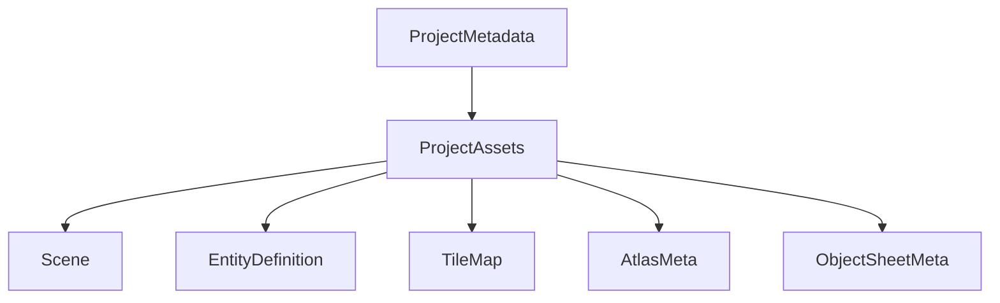
```mermaid
flowchart TD
    PM[ProjectMetadata]
    PA[ProjectAssets]
    SCN[Scene]
    ED[EntityDefinition]
    TM[TileMap]
    AT[AtlasMeta]
    OS[ObjectSheetMeta]

    PM --> PA
    PA --> SCN
    PA --> ED
    PA --> TM
    PA --> AT
    PA --> OS
```

Key authored asset meanings:

| Model | Meaning |
|---|---|
| `ProjectMetadata` | project-level metadata, runtime splash and audio mix, editor recents/layouts |
| `ProjectAssets` | discovered asset inventory used by editor tooling |
| `Scene` | scene composition: map references, scene entities, scene rules, optional camera overrides |
| `EntityDefinition` | reusable entity archetype: category, visuals, defaults, audio defaults |
| `TileMap` | tile grid plus persisted map-owned object instances |
| `AtlasMeta` | named tile metadata including solid/trigger flags, UV layout, `ColorMode` (PaletteIndexed or TrueColor) |
| `ObjectSheetMeta` | named placeable static object definitions extracted from a sprite sheet |

### 5.2 Entity model

The entity model separates identity from behavior.

Identity and behavior concepts:

| Concept | Owned by | Meaning |
|---|---|---|
| `category` | `EntityDefinition` / `Entity` | generic authored taxonomy such as human or creature |
| `EntityKind` | runtime `Entity` | internal runtime mechanics classification: `Player`, `Npc`, `Item`, `Decoration`, `Trigger`, `Projectile` |
| `control_role` | scene entity / runtime `Entity` | whether a placed entity is the current player character: `LegacyDefault` (resolves to `None`), `None`, `PlayerCharacter` |
| `movement_profile` | entity behavior | how an entity responds to input: `LegacyDefault` (resolves based on control role), `None`, `PlayerWasd` |
| `ai_behavior` | entity behavior via `AiConfig` | autonomous behavior such as `None`, `Wander`, `Chase`, `Run`, `RunAndMultiply` |
| `tags` | `EntityDefinition` / `Entity` | arbitrary string tags for rule conditions and dialog conditions |

This separation matters:

- a creature can be player-controlled
- a human can be AI-controlled
- movement behavior is not equivalent to player identity
- runtime player semantics derive from `control_role`, not from authored category

Entity attribute decomposition:

`EntityAttributes` groups runtime properties into three focused sub-structs:

| Sub-struct | Fields | Purpose |
|---|---|---|
| `EntityGameplay` | `health`, `stats` (`EntityStats` with base/current maps), `speed`, `solid` | gameplay-relevant numeric state |
| `EntityRendering` | `visible`, `has_shadow`, `palette_override`, `animation_controller`, `render_layer`, `static_object_render`, `grounding` (`EntityGrounding` with origin + `EntityFootprint`) | visual presentation state |
| `EntityBehavior` | `active`, `can_move`, `interactable`, `interaction_reach`, `ai_config`, `movement_profile`, `has_inventory` | behavioral flags and configuration |

Entity capabilities beyond identity:

| Concept | Owned by | Meaning |
|---|---|---|
| `EntityStats` | `EntityGameplay` | named stat values (health, attack power, custom stats) with base and current value maps |
| `Inventory` | sparse storage | item collection as `HashMap<String, u32>` (item ID to count) |
| `PickupDef` | sparse storage | defines an entity as a collectible item with `item_id` and `count` |
| `PrimaryProjectileDef` | sparse storage | projectile configuration for entities that can shoot |
| `ProjectileState` | sparse storage | runtime projectile tracking (velocity, lifetime, damage, owner) |
| `CollisionBox` | `Entity` | optional collision shape |
| `interactable` | `EntityBehavior` | whether the entity can be interacted with, plus `interaction_reach` distance |
| `EntityAudioComponent` | `EntityStorage` (separate map) | footstep tracking, per-entity audio runtime state |

Entity storage architecture:

`EntityStorage` uses a hybrid approach with mandatory and sparse components:

| Storage | Contents |
|---|---|
| `entities: HashMap<EntityId, Entity>` | mandatory entity data (position, size, kind, attributes, tags) |
| `audio_components: HashMap<EntityId, EntityAudioComponent>` | per-entity audio runtime state |
| `components: OptionalComponentRegistry` | sparse maps for optional components via `SparseComponentMap<T>` |

`OptionalEntityComponents` bundles the sparse fields: `primary_projectile`, `projectile`, `pickup`, `inventory`.

Entity definition structure:

`EntityDefinition` groups authored properties into focused sub-definitions:

| Sub-definition | Purpose |
|---|---|
| `RenderingDef` | size, render layer, visibility, shadow, palette override, static object rendering |
| `AttributesDef` | health, stats, speed, solidity, interactability, AI config, movement profile, projectile, pickup, inventory |
| `CollisionDef` | collision shape configuration |
| `AudioDef` | movement sound, collision sound, hearing radius, trigger mode |
| `AnimationsDef` | animation clip definitions per state (via `AnimationClipDef`) |

### 5.3 Map model

`TileMap` owns both terrain tiles and static map objects.

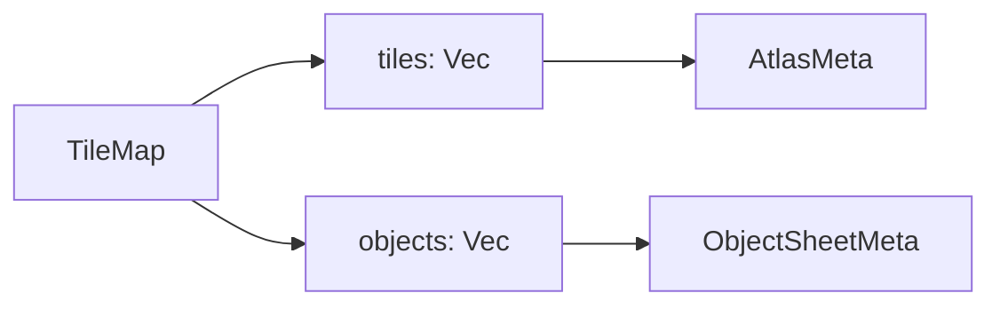
```mermaid
flowchart LR
    TM[TileMap]
    T[tiles: Vec<String>]
    MO[objects: Vec<MapObjectInstance>]
    AT[AtlasMeta]
    OS[ObjectSheetMeta]

    TM --> T
    TM --> MO
    T --> AT
    MO --> OS
```

`MapObjectInstance` currently stores:

- `sheet`
- `object_name`
- `position`
- `size_px`
- `visible`
- `solid`

This means map objects are persisted as part of the map asset, not as scene entities.

### 5.4 Audio model

Audio has three layers of control:

| Layer | Examples |
|---|---|
| project-wide mix | master, music, movement, collision |
| entity defaults | movement sound, collision sound, hearing radius, trigger mode |
| scene/map runtime events | actual `AudioEvent::PlaySound` or `BackgroundMusic` dispatch |

Movement audio can be emitted from multiple sources:

- direct input-driven movement
- AI wander movement
- rule-driven velocity movement
- animation-loop-triggered locomotion events

Per-entity audio configuration:

| Setting | Purpose |
|---|---|
| `movement_sound` | sound ID to play during movement |
| `movement_sound_trigger` | `Distance` (every N pixels) or `AnimationLoop` (on animation frame completion) |
| `footstep_trigger_distance` | distance threshold for distance-based triggers (default: 32.0) |
| `collision_sound` | sound ID for collision events |
| `hearing_radius` | spatial attenuation radius in pixels (default: 192) |

Spatial attenuation is listener-relative and currently uses the current player position as the listener.

`AudioEvent` carries channel routing and spatial data:

- `PlaySound { channel: AudioChannel, sound_id, source_position, hearing_radius }` - one-shot sound on `Movement` or `Collision` channel
- `BackgroundMusic(track_id)` - switch background music track

### 5.5 Rules model

Rules enable scene-specific behaviors without code changes. Each scene can define rules that respond to triggers and execute actions.

| Component | Purpose |
|---|---|
| `Rule` | named rule with trigger, conditions, actions, priority, one-time flag, enabled flag, log flag |
| `RuleTrigger` | event that activates the rule |
| `RuleCondition` | prerequisite checks before action execution |
| `RuleAction` | effect to apply when rule fires |
| `RuleTarget` | resolution strategy for which entity an action/condition applies to |
| `TriggerContext` | carries `trigger_self` and `trigger_other` entity IDs for contextual resolution |
| `RuleRuntimeState` | per-scene runtime state: fired-once tracking, velocity overrides, per-frame event buffers, tile position tracking |

Rule structure fields:

| Field | Default | Purpose |
|---|---|---|
| `id` | — | unique identifier |
| `enabled` | `true` | whether the rule is active |
| `priority` | `0` | execution order (higher first) |
| `once` | `false` | fire only on first trigger |
| `log_enabled` | `false` | debug logging for this rule |
| `trigger` | — | activation event |
| `conditions` | `[]` | prerequisite checks |
| `actions` | `[]` | effects to apply |

Supported triggers:

- `OnStart` - scene initialization
- `OnUpdate` - every frame
- `OnPlayerMove` - player movement input
- `OnKey { key: RuleKey }` - specific key press (Up, Down, Left, Right, DebugToggle, Interact, AttackPrimary, AttackSecondary, Inventory, Pause)
- `OnCollision { entity }` - entity collision event (optional target filter)
- `OnDamaged { entity }` - entity receives damage (optional target filter)
- `OnDeath { entity }` - entity health reaches zero (optional target filter)
- `OnTrigger` - trigger zone activation
- `OnInteract { mode, entity }` - entity interaction event with spatial mode (Overlap, Adjacent, InFront) and optional target filter
- `OnDialogComplete { dialog_id, outcome_id }` - dialog completed with specific outcome
- `OnTileEnter { x, y }` - entity enters a specific tile
- `OnTileExit { x, y }` - entity exits a specific tile

Supported conditions:

| Condition | Purpose |
|---|---|
| `Always` | unconditionally true |
| `TargetExists { target }` | check that target entity exists |
| `KeyHeld { key }` | check if a key is currently held |
| `EntityActive { target, is_active }` | check entity active state |
| `HealthBelow { target, threshold }` | entity health below threshold |
| `HealthAbove { target, threshold }` | entity health above threshold |
| `TriggerOtherIsPlayer` | the other entity in the trigger context is the player |
| `EntityIsKind { target, kind }` | entity matches an `EntityKind` |
| `TriggerOtherIsKind { kind }` | trigger-other matches an `EntityKind` |
| `EntityHasTag { target, tag }` | entity has a specific tag |
| `TriggerOtherHasTag { tag }` | trigger-other has a specific tag |
| `HasInventoryItem { target, item_id, min_count }` | inventory contains at least N of an item |
| `FlagEquals { flag, value }` | game flag equals a specific `FlagValue` |
| `FlagSet { flag }` | game flag exists and is set |
| `FlagGreaterThan { flag, value }` | integer game flag exceeds threshold |

Supported actions:

| Action | Purpose |
|---|---|
| `PlaySound { channel, sound_id }` | play sound on Movement or Collision channel |
| `PlayMusic { track_id }` | switch background music |
| `PlayAnimation { target, state }` | change entity animation |
| `SetVelocity { target, velocity }` | apply movement velocity |
| `Spawn { entity_type, position }` | create new entity (PlayerLikeNpc, Npc, Item, Decoration, Trigger) |
| `DestroySelf { target }` | remove entity |
| `SwitchScene { scene_name, spawn_point_id, transition, duration_ms }` | transition to another scene with optional transition effect and duration |
| `StartDialog { dialog_id }` | start a dialog tree |
| `DamageEntity { target, amount }` | apply damage to entity |
| `HealEntity { target, amount }` | heal entity with cap |
| `AddInventoryItem { target, item_id, count }` | add items to inventory |
| `RemoveInventoryItem { target, item_id, count }` | remove items from inventory |
| `SetEntityActive { target, active }` | activate or deactivate an entity |
| `TeleportEntity { target, tile_x, tile_y }` | move entity to tile position |
| `SetFlag { flag, value }` | set a game flag to a `FlagValue` (Bool, Int, or String) |
| `IncrementFlag { flag, amount }` | increment an integer game flag |
| `ClearFlag { flag }` | remove a game flag |
| `SaveGame { slot }` | save game state to a slot |
| `LoadGame { slot }` | load game state from a slot |

Rule targets:

| Target | Resolution |
|---|---|
| `Player` | current player entity |
| `Entity(id)` | specific entity by ID |
| `RuleOwner` | entity that owns the rule |
| `TriggerSelf` | the "self" entity from trigger context |
| `TriggerOther` | the "other" entity from trigger context |

Rules execute in priority order and can be marked `once: true` to fire only on first trigger. The rule runtime tracks per-frame event buffers for collisions, damage, death, interaction, dialog completion, and tile transitions.

### 5.6 Flag model

The flag system provides persistent key-value game state that survives across frames and can be saved/loaded.

| Component | Purpose |
|---|---|
| `GameFlags` | `HashMap<String, FlagValue>` store owned by `ProgressState` |
| `FlagValue` | typed value: `Bool(bool)`, `Int(i32)`, or `String(String)` |

Key capabilities:

- `get`, `set`, `clear`, `increment`, `is_set`, `iter`
- flags are manipulated by rule actions (`SetFlag`, `IncrementFlag`, `ClearFlag`)
- flags are checked by rule conditions (`FlagEquals`, `FlagSet`, `FlagGreaterThan`)
- flags are checked by dialog conditions (`FlagEquals`, `FlagSet`, `FlagGreaterThan`)
- flags are persisted as part of save data via `ProgressState`

The flag system bridges rules, dialogs, and persistence:

- rules can set flags to track quest progress, visited locations, or triggered events
- dialog conditions can branch based on flag state
- rule conditions can gate actions based on flag state
- save/load preserves all flag state

### 5.7 Menu model

The menu system is project-configurable and supports runtime customization.

| Component | Purpose |
|---|---|
| `MenuSettings` | root menu configuration in `project.toml` |
| `MenuAppearance` | visual styling (fonts, colors, spacing, opacity, borders) |
| `MenuScreenDefinition` | screen layout with title, entries, and bindings |
| `MenuDialogDefinition` | modal dialog definitions |
| `MenuBorderStyle` | rendering style for menu borders |
| `UiAction` / `UiCommand` | generic interaction model shared by screens and dialogs |

Appearance settings include:

- font family and size
- five color values (border, text, three backgrounds)
- transparent background toggles
- menu dimensions (width/height percent)
- spacing values (title, button, footer)
- opacity and border style

Menu/dialog rendering is intentionally shared across runtime and editor:

- menu and dialog definitions live in `toki-core::menu`
- generic UI blocks live in `toki-core::ui`
- runtime and editor both compose those definitions into `UiComposition`
- dialogs and screens emit generic `UiAction` values rather than menu-specific commands

### 5.8 Dialog model

The dialog system supports branching conversation trees authored per scene.

| Component | Purpose |
|---|---|
| `DialogTree` | root container: ID, title, entry node, cancel/gate flags, list of nodes |
| `DialogNode` | individual dialog step: ID, optional speaker name, conditions, node kind |
| `DialogNodeKind` | node behavior variant |
| `DialogChoice` | player-selectable option with label, target node, and conditional visibility |
| `DialogBranch` | automatic branch with conditions and target node |
| `DialogCondition` | runtime condition for choices and branches |
| `DialogController` | runtime state machine: start, advance, close, input handling |

Node kinds:

- `Line` - display text, advance to next node
- `Choice` - display text with player-selectable options
- `Branch` - automatic routing based on runtime conditions
- `End` - terminal node with optional outcome ID

Dialog conditions:

| Condition | Purpose |
|---|---|
| `HealthBelow { target, threshold }` | entity health check |
| `HealthAbove { target, threshold }` | entity health check |
| `HasInventoryItem { target, item_id, min_count }` | inventory check |
| `EntityHasTag { target, tag }` | tag check |
| `EntityIsKind { target, entity_kind }` | entity kind check |
| `FlagEquals { flag, value }` | game flag equals a specific `FlagValue` |
| `FlagSet { flag }` | game flag exists and is set |
| `FlagGreaterThan { flag, value }` | integer game flag exceeds threshold |

Condition targets can be `Player`, `Interactor`, or `Speaker`.

Runtime properties:

- `DialogController` manages active dialog state and exposes `MenuDialogView` for rendering through the shared UI composition path
- dialogs can gate gameplay (`gate_gameplay: true`) to pause simulation while open
- dialog completion produces a `DialogCompletion` with optional `outcome_id`, which feeds into the rules system via `OnDialogCompletion` triggers
- the editor provides a visual dialog tree editor for authoring node graphs

### 5.9 AI model

The AI system drives autonomous entity behavior through a behavior-handler architecture.

| Component | Purpose |
|---|---|
| `AiSystem` | top-level update dispatcher |
| `AiRuntimeState` | per-entity runtime state: frame counter, wander phase, wait frames, separation |
| `AiBehavior` | authored behavior type assigned to entity definitions: `None`, `Wander`, `Chase`, `Run`, `RunAndMultiply` |
| `AiConfig` | behavior configuration parameters |
| `AiContext` | movement parameters passed to behavior handlers |

Behavior handlers:

| Handler | Behavior |
|---|---|
| `WanderHandler` | idle/walk cycle with random direction, configurable distance and speed |
| `ChaseHandler` | pursue a target entity |
| `RunHandler` | run-and-multiply: seek mate, spawn offspring, maintain separation distance |

AI update produces an `AiUpdateResult` per entity:

- optional new position
- optional new animation state
- movement distance (for audio triggers)
- optional spawn request (for run-and-multiply behavior)

Wander phase state machine:

- `Waiting` - idle with countdown
- `Walking { direction, remaining_distance }` - moving in chosen direction

Separation logic ensures spawned entities maintain minimum distance from parents and siblings.

### 5.10 Camera model

The camera system provides viewport management for both runtime and editor.

| Component | Purpose |
|---|---|
| `Camera` | position (top-left in world space), viewport size, zoom factor |
| `CameraMode` | `FollowEntity(EntityId)` or `FreeScroll` |
| `CameraController` | mode-driven camera updates |

Key capabilities:

- zoom-aware projection calculation
- viewport-to-world and world-to-viewport coordinate conversion
- world bounds clamping
- centering on arbitrary world positions

The runtime `CameraManager` wraps `CameraController` to handle follow-camera updates and visible-chunk tracking. The editor viewport manages its own camera state for pan/zoom interactions.

### 5.11 Palette model

The palette system supports Game Boy-style 4-color palettes for sprite recoloring and post-processing.

| Component | Purpose |
|---|---|
| `Palette4` | 4-color palette (each color as RGBA) |
| `PaletteAssetFile` | serialized palette asset format |
| built-in palettes | predefined palettes accessible by name |

Key capabilities:

- palette asset loading and saving from project files
- built-in palette registry (`builtin_palettes()`)
- palette resolution by ID with project override support
- indexed image validation (color count, invalid colors)
- indexed image recoloring against a target palette

Palettes are used by:

- entity definitions via `palette_override` in `RenderingDef`
- post-processing pipeline via `quantize_palette` in `ResolvedPostProcessSettings`
- the `palette` JSON schema in `toki-schemas`

### 5.12 Viewport model

The runtime viewport system controls how the logical game viewport maps to the application window.

| Mode | Parameters | Behavior |
|---|---|---|
| `AspectFit` | `fit_percent: u16` | scale viewport to fit window while preserving aspect ratio, with configurable fill percentage |
| `IntegerScale` | `factor: IntegerScaleFactor` | scale by integer multiples only, preserving pixel-perfect rendering |
| `WindowFill` | `zoom_percent: u16` | fill the window completely with configurable zoom level |

Viewport mode is configured in `project.toml` via `RuntimeViewportMode` and can be changed live during runtime through the display settings overlay. Changes are persisted to `runtime_config.json`.

### 5.13 Game state model

`GameState` is decomposed into four focused state containers:

| Container | Fields | Purpose |
|---|---|---|
| `WorldState` | `entity_manager`, `entity_definitions`, `player_id` | entity registry, definitions, and player tracking |
| `SceneState` | `scene_manager`, `active_rules`, `persistent_scene_entities` | scene management, active rule set, cross-scene entity tracking |
| `ProgressState` | `game_flags`, `play_time_ms` | persistent game progress: flags and play time |
| `RuntimeState` | `input`, `debug_collision_rendering`, `ai`, `rules`, `effects` | transient per-session state: input, AI runtime, rule runtime, effect runtime |
| `EffectRuntimeState` | `pending_stat_changes`, `pending_despawns` | deferred stat changes and entity removal queue |

This decomposition ensures:

- world state is serializable for save/load
- scene state resets cleanly on scene transitions
- progress state persists across scenes and save slots
- runtime state is transient and never serialized

## 6. Dynamic View

### 6.1 Runtime startup

Runtime supports both project-directory and packed-bundle startup.

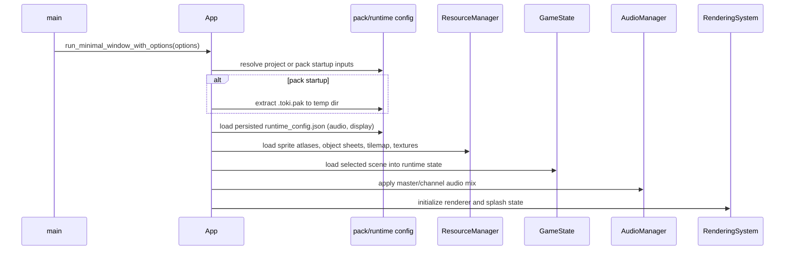
```mermaid
sequenceDiagram
    participant M as main
    participant A as App
    participant P as pack/runtime config
    participant R as ResourceManager
    participant G as GameState
    participant AU as AudioManager
    participant RS as RenderingSystem

    M->>A: run_minimal_window_with_options(options)
    A->>P: resolve project or pack startup inputs
    alt pack startup
        A->>P: extract .toki.pak to temp dir
    end
    A->>P: load persisted runtime_config.json (audio, display)
    A->>R: load sprite atlases, object sheets, tilemap, textures
    A->>G: load selected scene into runtime state
    A->>AU: apply master/channel audio mix
    A->>RS: initialize renderer and splash state
```

Important runtime properties:

- startup is scene/map driven, not only demo-driven
- object sheets are loaded separately from sprite atlases
- derived `TOKI_VERSION` is logged at startup and shown on the splash screen
- persisted runtime settings (audio mix, display options) are restored from `runtime_config.json` if available

### 6.2 Runtime frame loop

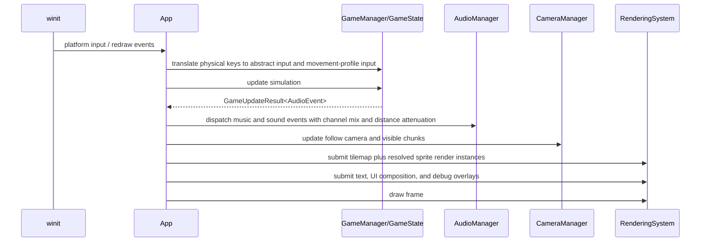
```mermaid
sequenceDiagram
    participant W as winit
    participant A as App
    participant G as GameManager/GameState
    participant AU as AudioManager
    participant C as CameraManager
    participant RS as RenderingSystem

    W->>A: platform input / redraw events
    A->>G: translate physical keys to abstract input and movement-profile input
    A->>G: update simulation
    G-->>A: GameUpdateResult<AudioEvent>
    A->>AU: dispatch music and sound events with channel mix and distance attenuation
    A->>C: update follow camera and visible chunks
    A->>RS: submit tilemap plus resolved sprite render instances
    A->>RS: submit text, UI composition, and debug overlays
    A->>RS: draw frame
```

Behavioral notes:

- all movement paths use shared collision gates
- solid map objects, solid entities, and solid tiles all participate in blocking
- left-facing directional animation uses render-time flip state rather than duplicated art
- map-owned object-sheet instances render in runtime as part of the map
- runtime and editor both use the shared sprite-render request pipeline for world sprites
- runtime menus and dialogs render through the shared UI composition path rather than a menu-specific renderer
- AI-driven entities update through `AiSystem` producing movement, animation, and spawn requests
- entity interactions are collected per frame with spatial detection (overlap, adjacent, in-front)
- active dialogs can gate gameplay, pausing simulation while open
- scene transitions are coordinated through `SceneTransitionController` with player state preservation
- post-processing effects (tint, quantize, dither, Game Boy palette, vignette) apply per frame through `PostProcessPipeline`
- rule actions can trigger save/load operations via `PersistenceRequest`
- flag mutations from rules are applied to `ProgressState` and persist across frames

Timing modes:

The runtime supports two timing modes configured in `project.toml`:

| Mode | Update path | Behavior |
|---|---|---|
| `Fixed` (default) | `GameState::update()` | 60 FPS fixed timestep (16.67ms per tick) |
| `Delta` | `GameState::update_with_delta(delta_ms)` | variable timestep with frame-rate scaling |

In delta mode, movement speeds and animation deltas scale proportionally to elapsed time. Movement uses sub-pixel accumulation per axis with sign-flip reset on direction change.

### 6.3 Editor project-open flow

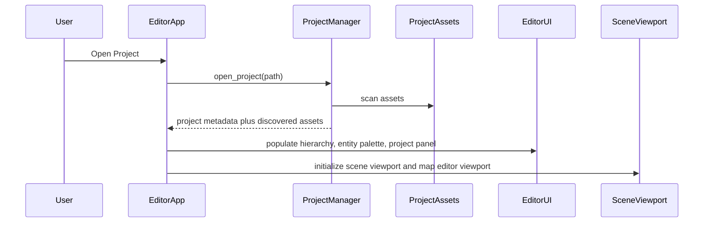
```mermaid
sequenceDiagram
    participant U as User
    participant EA as EditorApp
    participant PM as ProjectManager
    participant PA as ProjectAssets
    participant UI as EditorUI
    participant SV as SceneViewport

    U->>EA: Open Project
    EA->>PM: open_project(path)
    PM->>PA: scan assets
    PM-->>EA: project metadata plus discovered assets
    EA->>UI: populate hierarchy, entity palette, project panel
    EA->>SV: initialize scene viewport and map editor viewport
```

### 6.4 Scene workflow

The scene workflow is scene-centric.

Main responsibilities:

- choose active scene
- choose maps referenced by that scene
- place and move scene entities
- edit entity/scene properties and rules
- preview runtime-style rendering through the scene viewport

Scene flow:

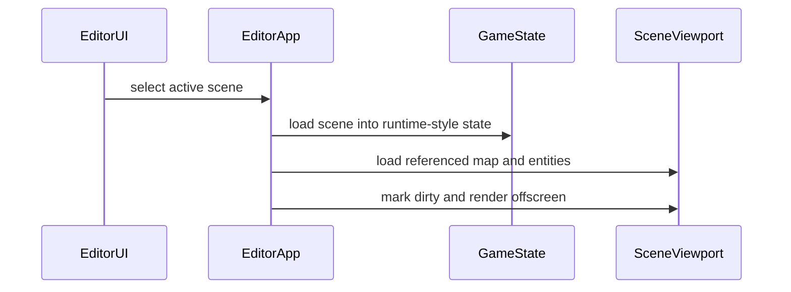
```mermaid
sequenceDiagram
    participant UI as EditorUI
    participant EA as EditorApp
    participant GS as GameState
    participant SV as SceneViewport

    UI->>EA: select active scene
    EA->>GS: load scene into runtime-style state
    EA->>SV: load referenced map and entities
    EA->>SV: mark dirty and render offscreen
```

### 6.5 Map editor workflow

The map editor is asset-centric and intentionally independent of the active scene.

Main responsibilities:

- create map drafts in memory
- load existing map assets directly
- paint/fill/pick tiles
- place, move, inspect, and delete map-owned objects
- save back to `assets/tilemaps/*.json`
- maintain its own undo/redo history

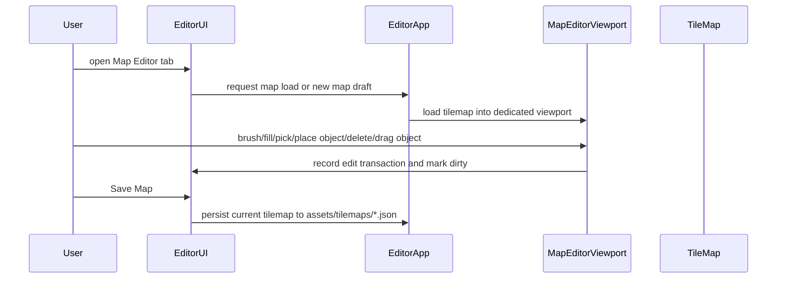
```mermaid
sequenceDiagram
    participant U as User
    participant UI as EditorUI
    participant EA as EditorApp
    participant MV as MapEditorViewport
    participant TM as TileMap

    U->>UI: open Map Editor tab
    UI->>EA: request map load or new map draft
    EA->>MV: load tilemap into dedicated viewport
    U->>MV: brush/fill/pick/place object/delete/drag object
    MV->>UI: record edit transaction and mark dirty
    U->>UI: Save Map
    UI->>EA: persist current tilemap to assets/tilemaps/*.json
```

Current map-editor tools:

- `Drag`
- `Brush`
- `Fill`
- `Pick Tile`
- `Place Object`
- `Delete`

### 6.6 Inspector and project panel workflow

The right-side panel has two distinct responsibilities:

- `Inspector`: selection-driven editing of the current selection (entity, scene, map object, menu surface, menu entry)
- `Project`: project-wide settings (metadata, splash duration, audio mixer, display settings)

### 6.7 Runtime menu and dialog workflow

The runtime menu flow is project-authored but executed through shared core types.

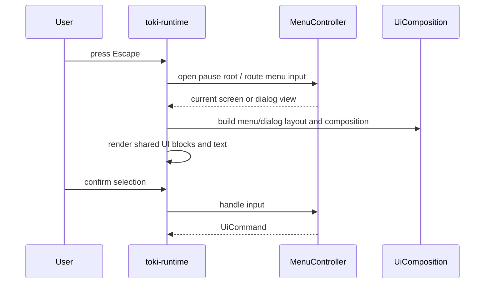
```mermaid
sequenceDiagram
    participant U as User
    participant RT as toki-runtime
    participant MC as MenuController
    participant UI as UiComposition

    U->>RT: press Escape
    RT->>MC: open pause root / route menu input
    MC-->>RT: current screen or dialog view
    RT->>UI: build menu/dialog layout and composition
    RT->>RT: render shared UI blocks and text
    U->>RT: confirm selection
    RT->>MC: handle input
    MC-->>RT: UiCommand
```

Current properties:

- project menus are authored in `project.toml`
- the editor previews those menus through the same layout/composition logic used by runtime
- confirmation dialogs are authored separately from menu screens but use the same action model
- runtime currently consumes `UiCommand::ExitRuntime` directly and queues `UiCommand::EmitEvent` for downstream consumers

### 6.8 Runtime dialog workflow

Dialogs are triggered by the rules system or by direct interaction and rendered through the shared UI composition path.

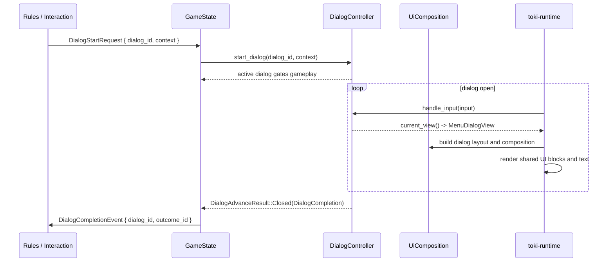
```mermaid
sequenceDiagram
    participant R as Rules / Interaction
    participant G as GameState
    participant DC as DialogController
    participant UI as UiComposition
    participant RT as toki-runtime

    R->>G: DialogStartRequest { dialog_id, context }
    G->>DC: start_dialog(dialog_id, context)
    DC-->>G: active dialog gates gameplay
    loop dialog open
        RT->>DC: handle_input(input)
        DC-->>RT: current_view() -> MenuDialogView
        RT->>UI: build dialog layout and composition
        RT->>RT: render shared UI blocks and text
    end
    DC-->>G: DialogAdvanceResult::Closed(DialogCompletion)
    G->>R: DialogCompletionEvent { dialog_id, outcome_id }
```

Key properties:

- dialog context carries `interactor` and `speaker` entity IDs for condition evaluation
- dialog conditions can check health, inventory, tags, entity kind, and game flags against player, interactor, or speaker
- dialog completion feeds back into the rules system via `OnDialogCompletion` triggers
- the editor provides a visual dialog tree editor for authoring and a runtime-style preview through the shared composition path

### 6.9 Scene transition workflow

Scene transitions are orchestrated by the runtime when a `SwitchScene` rule action fires or the game requests a scene change.

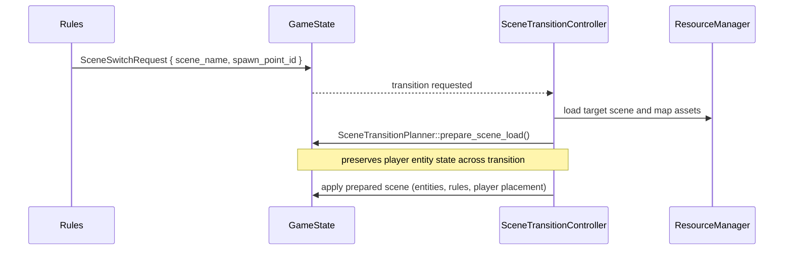
```mermaid
sequenceDiagram
    participant R as Rules
    participant G as GameState
    participant TC as SceneTransitionController
    participant RM as ResourceManager

    R->>G: SceneSwitchRequest { scene_name, spawn_point_id }
    G-->>TC: transition requested
    TC->>RM: load target scene and map assets
    TC->>G: SceneTransitionPlanner::prepare_scene_load()
    Note over TC,G: preserves player entity state across transition
    TC->>G: apply prepared scene (entities, rules, player placement)
```

Key properties:

- player entity state (inventory, stats, attributes, flags) is preserved across transitions
- the target spawn point determines player placement in the new scene
- entity definitions are re-instantiated from the target scene's entity list
- rule runtime state resets per scene
- transitions can specify a visual effect (`SceneTransitionEffect::Fade`) and duration

### 6.10 Save/load workflow

Save and load can be triggered by rule actions (`SaveGame`, `LoadGame`) or by menu commands.

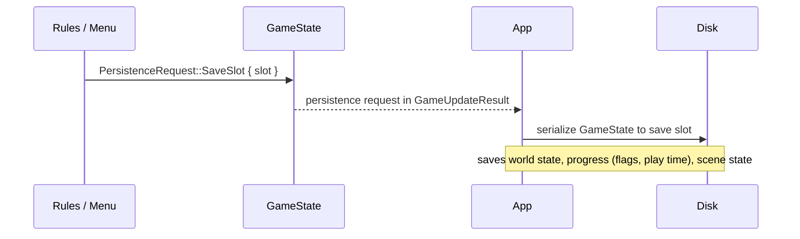
```mermaid
sequenceDiagram
    participant R as Rules / Menu
    participant G as GameState
    participant A as App
    participant D as Disk

    R->>G: PersistenceRequest::SaveSlot { slot }
    G-->>A: persistence request in GameUpdateResult
    A->>D: serialize GameState to save slot
    Note over A,D: saves world state, progress (flags, play time), scene state
```

Key properties:

- `GameFlags` and `play_time_ms` are persisted in `ProgressState`
- save slots are numbered (u8)
- runtime display/audio settings are persisted separately in `runtime_config.json`

## 7. Layering Rules and Architectural Invariants

### 7.1 Layering rules

1. Schemas define serialized shape only.
2. Project assets define authored content only.
3. `toki-core` defines runtime meaning and simulation rules.
4. `toki-render` consumes prepared render data, not raw project files.
5. Runtime and editor may orchestrate core/render differently, but they must not redefine core semantics.
6. Scene composition and map editing are separate workflows even when they share rendering code.

### 7.2 Invariants

| Invariant | Definition | Enforced by |
|---|---|---|
| I1 | canonical JSON schemas come from one place only | `toki-schemas` |
| I2 | runtime truth lives in `GameState` / `EntityManager`, not in UI or renderer | `toki-core/src/game/`, `toki-core/src/entity/` |
| I3 | player identity derives from `control_role`, not authored category | scene loading and entity manager player tracking |
| I4 | movement behavior derives from `movement_profile`, not player identity | `GameState` input routing |
| I5 | autonomous behavior derives from `ai_behavior`, not category alone | `AiSystem` dispatch path |
| I6 | map objects belong to the map asset, not to the scene entity list | `TileMap::objects`, map-editor persistence |
| I7 | editor placement/drag validation uses the same collision semantics as runtime movement | `toki-core/src/collision.rs`, editor interaction modules |
| I8 | runtime/editor rendering consume renderer-ready snapshots and metadata, not raw project documents directly | `SceneViewport`, runtime rendering system |
| I9 | dialog completion feeds into the rules system, not into ad-hoc game logic | `DialogCompletionEvent`, `OnDialogCompletion` trigger |
| I10 | scene transitions preserve player state and reset rule state | `SceneTransitionPlanner`, `RuleRuntimeState` |
| I11 | game flags are the sole mechanism for cross-rule persistent state | `GameFlags` in `ProgressState`, rule flag actions/conditions |

## 8. Known Seams and Current Debt

The architecture is coherent, but a few seams are still visible and should remain explicit.

### 8.1 Duplicate resource-manager ownership

There are still two `ResourceManager` implementations in the workspace:

- `toki-core::resources::ResourceManager`
- `toki-runtime::systems::resources::ResourceManager`

This is the main remaining resource-loading debt. The runtime manager owns the richer multi-atlas/object-sheet path, while the core manager still exists and is used by editor-facing code. The duplication is narrower than before, but authority is not yet fully unified.

### 8.2 Render entrypoint split

Rendering is still shared across two orchestration styles:

- `SceneRenderer` for editor/offscreen composition
- `GpuState` for runtime-direct rendering

Recent refactors reduced duplication by moving sprite extraction into `toki-core::sprite_render` and menu/dialog composition into `toki-core::ui`, but tilemap/offscreen orchestration and some backend-specific state still remain split.

### 8.3 Validation depth

Schema validation exists and is useful, but deeper semantic validation remains limited. Examples of future semantic checks:

- missing atlas tile names referenced by maps
- missing object-sheet object names referenced by map objects
- stale entity definition references in scenes
- cross-asset validation of animation clip frame names

### 8.4 Runtime/editor object editing asymmetry

Map objects are fully editable in the map editor and render in runtime, but scene-viewport editing of map objects is still behind scene-entity editing in ergonomics.

### 8.5 Scene-path authority mismatch

Project metadata supports explicit scene-path mapping in `project.toml`, but runtime startup still resolves scenes through the canonical `scenes/{name}.json` path. This works for convention-following projects, but it is still a correctness gap between editor/project metadata and runtime bootstrap.

## 9. Build, Test, and Release Architecture

The workspace is built and released as a coordinated multi-crate system.

Primary quality surfaces:

- `cargo fmt --all --check`
- `cargo clippy --workspace --all-targets -- -D warnings`
- `cargo test --workspace`
- `just coverage`
- CI workflows in `.github/workflows`

Release structure:

- shared workspace versioning in root `Cargo.toml`
- changelog-driven release prep in `CHANGELOG.md`
- build scripts in editor/runtime derive `TOKI_VERSION`
- derived version displayed in splash screen and startup logs

## 10. Architecture Summary

The architecture consists of six layers:

1. **Schema layer** (`toki-schemas`) - canonical JSON schema definitions
2. **Persistence layer** - `project.toml`, scene/entity/map/atlas JSON files
3. **Core domain layer** (`toki-core`) - simulation, collision, rules, entity management, flags, dialogs
4. **Render infrastructure layer** (`toki-render`) - WGPU pipelines, text layout, render targets, multi-texture sprite batching
5. **Runtime shell** (`toki-runtime`) - game execution, audio playback, input handling, settings persistence
6. **Editor shell** (`toki-editor`) - project management, scene/map editing, asset inspection, entity/animation/sprite/dialog/rule authoring

Key architectural decisions:

- `control_role`, `movement_profile`, `ai_behavior`, and `category` are independent concerns
- map editing operates on map assets directly, separate from scene editing
- tile atlases and object sheets are distinct asset types
- project-level configuration (audio, display, menu) is separate from scene/entity settings
- runtime accepts both project directories and packed bundles
- `GameState` is modularized into focused submodules (movement, combat, rules, scene, input, interaction, stat effects, transitions)
- `EntityAttributes` is decomposed into `EntityGameplay`, `EntityRendering`, and `EntityBehavior` sub-structs
- entity storage uses a hybrid mandatory/sparse pattern: core data in `Entity`, optional components in `SparseComponentMap`
- the rules engine is a full submodule tree with event collection, condition evaluation, action buffering, and command application
- the flag system (`GameFlags` with `FlagValue::Bool/Int/String`) bridges rules, dialogs, and save/load for persistent game state
- timing supports fixed timestep (60 FPS) or delta-scaled modes
- rules system enables declarative scene behaviors without code changes, including dialog triggers, inventory manipulation, entity activation, teleportation, flag management, and save/load
- dialog trees are a first-class domain model with branching, conditions (including flag conditions), and runtime controller, feeding completion events back into rules
- AI behaviors are handled through a behavior-handler architecture with wander, chase, and run-and-multiply handlers
- 4-color palette system supports Game Boy-style sprite recoloring and post-processing effects
- camera system provides zoom-aware viewport with follow-entity and free-scroll modes
- scene transitions preserve player state across scene boundaries with configurable visual effects
- runtime and editor share menu/dialog composition and sprite-render request resolution through `toki-core`
- runtime viewport supports three modes (AspectFit, IntegerScale, WindowFill) with live switching
- runtime audio and display settings are persisted to `runtime_config.json` for cross-session continuity
- the editor provides dedicated authoring panels for entities, animations, sprites, dialog trees, and rule graphs in addition to scene/map editing
